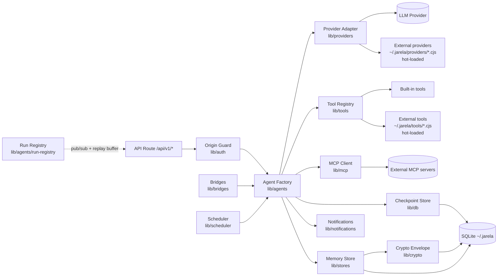
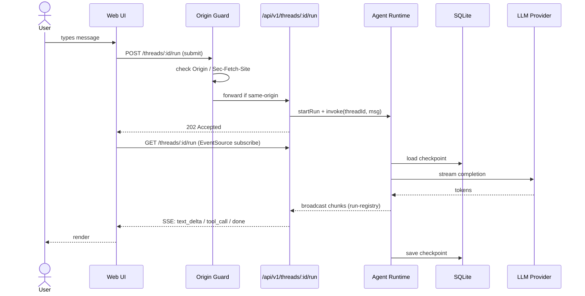
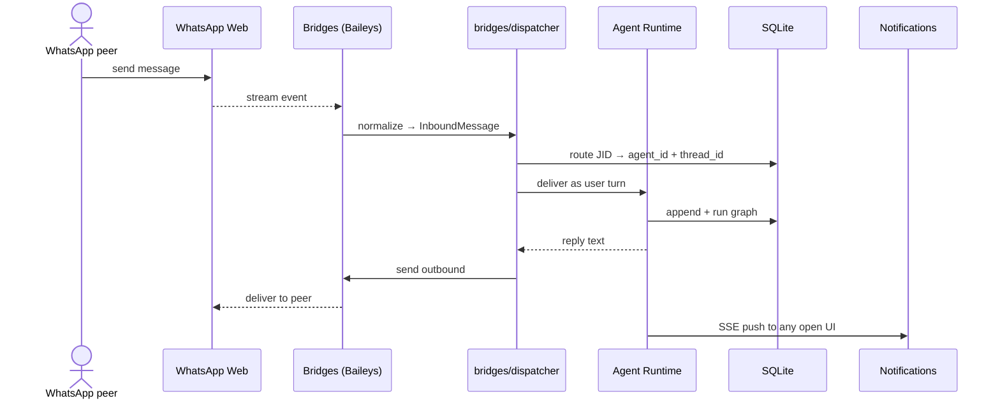
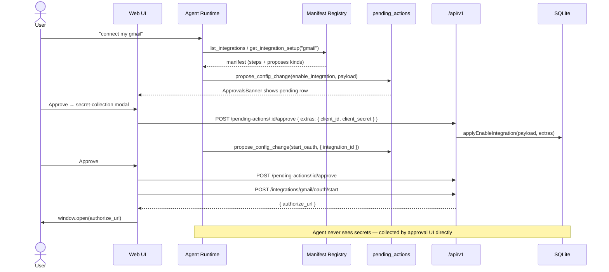
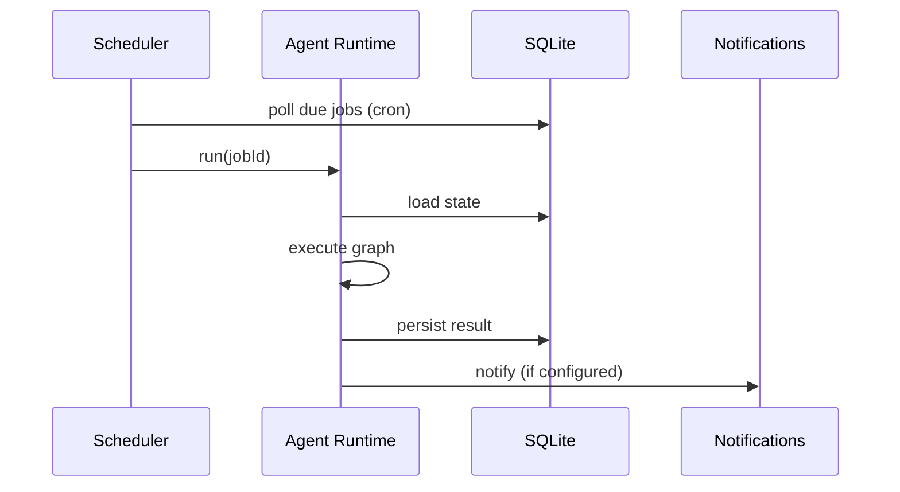

# Architecture — Jarela

## C4 — Container

```mermaid
C4Container
    title Containers — Jarela
    Person(user, "Developer", "Browser / installed PWA")
    Person_Ext(wa_user, "WhatsApp peer", "Phone number paired via Baileys")

    System_Boundary(b, "Jarela (Next.js process)") {
      Container(ui, "Web UI", "React 19 + Tailwind", "Chat, agents, models, memory, integrations panels")
      Container(guard, "Origin / CSRF Guard", "lib/auth", "Rejects cross-origin mutating requests; same-origin enforcement")
      Container(routes, "API Routes", "Next.js Route Handlers", "REST + SSE endpoints under /api/v1")
      Container(agents, "Agent Runtime", "LangGraph + @langchain/*", "State-machine orchestration of LLM + tools")
      Container(mcp, "MCP Adapter", "@langchain/mcp-adapters", "Discovers & invokes external MCP tool servers")
      Container(sched, "Scheduler", "cron-parser", "Runs background tasks on schedule, persists in DB")
      Container(bridges, "Bridges", "lib/bridges", "Inbound transports (WhatsApp/Baileys) routed to agents")
      Container(registry, "Run Registry", "lib/agents/run-registry", "In-memory pub/sub of in-flight agent chunks; replay buffer for reattaching EventSource clients")
      Container(crypto, "Crypto Envelope", "lib/crypto", "AES-GCM-at-rest for sensitive memory + OAuth tokens; OS keychain or .secret-key fallback")
      Container(proxy, "Proxy Dispatcher", "lib/proxy", "undici GlobalDispatcher; reads HTTP_PROXY env vars + encrypted proxy_config row; gates all outbound HTTP (ADR-0009)")
      ContainerDb(db, "SQLite", "@langchain/langgraph-checkpoint-sqlite + native sqlite", "Checkpoints, memory, settings, schedules, proposals, bridges — at ~/.jarela")
      ContainerDb(extdir, "Extension dirs", "filesystem (~/.jarela/{providers,tools}/)", "Drop-in .cjs files for external providers + tools, hot-loaded per request (ADR-0013)")
    }

    System_Ext(anthropic, "Anthropic", "Claude")
    System_Ext(openai, "OpenAI", "GPT")
    System_Ext(google, "Google GenAI", "Gemini")
    System_Ext(deepseek, "DeepSeek", "OpenAI-compatible")
    System_Ext(cohere, "Cohere", "Embeddings")
    System_Ext(mcps, "MCP Servers", "External tool providers (stdio / SSE)")
    System_Ext(mcpreg, "MCP Registry", "registry.modelcontextprotocol.io — discovery only (ADR-0014)")
    System_Ext(github, "GitHub API", "Issues / PRs / Repos (native github_* tools, ADR-0015) + Copilot OAuth (model provider)")
    System_Ext(whatsapp, "WhatsApp Web", "Baileys-paired endpoint")

    Rel(user, ui, "HTTPS")
    Rel(ui, guard, "fetch + EventSource")
    Rel(guard, routes, "allow same-origin")
    Rel(routes, agents, "invoke")
    Rel(agents, mcp, "tool calls")
    Rel(agents, registry, "broadcast chunks")
    Rel(routes, registry, "subscribe (GET SSE) / submit (POST 202)")
    Rel(routes, sched, "register / trigger")
    Rel(sched, agents, "run scheduled job")
    Rel(wa_user, whatsapp, "message")
    Rel(whatsapp, bridges, "stream events")
    Rel(bridges, agents, "deliver as user turn")
    Rel(agents, db, "checkpoint / memory (via crypto)")
    Rel(agents, crypto, "encrypt sensitive at rest")
    Rel(crypto, db, "store ciphertext")
    Rel(stream, anthropic, "HTTPS")
    Rel(stream, openai, "HTTPS")
    Rel(stream, google, "HTTPS")
    Rel(stream, deepseek, "HTTPS")
    Rel(agents, cohere, "embed")
    Rel(mcp, mcps, "stdio / SSE")
    Rel(routes, mcpreg, "HTTPS (picker search)")
    Rel(routes, github, "HTTPS")
    Rel(agents, extdir, "scan per request (cache-busted require)")
    Rel(proxy, db, "read proxy_config (via crypto)")
    Rel(stream, proxy, "outbound via GlobalDispatcher")
    Rel(routes, proxy, "outbound via GlobalDispatcher")
```

## C4 — Component (Agent Runtime)



## Key Flow — User sends a chat turn



## Key Flow — Inbound bridge message (WhatsApp)



## Key Flow — Agent-led integration setup (ADR-0010)



## Key Flow — Scheduled background task



## Non-Functional Requirements

| NFR | Target | Notes |
|---|---|---|
| Cold start (dev) | < 5 s | `npm run dev` |
| First token latency | < 1.5 s p95 | Network-bound on provider |
| Local-only operation | required | No telemetry, no required cloud backend |
| Persistence | survive process restart | All state in `~/.jarela/*.sqlite` |
| API key handling | never leave the host | Stored in DB or env, not synced |
| Same-origin enforcement | required | CSRF / DNS-rebinding guard in `lib/auth/access.ts` |
| Secrets at rest | required for sensitive namespaces | AES-GCM envelope, master key in OS keychain or `.secret-key` fallback |
| Outbound proxy support | required on corporate networks | env vars or in-app `proxy_config` row, applied via undici `setGlobalDispatcher` (ADR-0009); env wins over DB |
| Stream resilience | reattach within seconds of network change | EventSource auto-reconnect + 4000-event replay buffer in `lib/agents/run-registry.ts` (ADR-0008) |
| CI on every push | required | `.github/workflows/ci.yml`: lint + tsc + build + live integration suite |

## External Dependencies

| Dependency | Purpose | Failure mode |
|---|---|---|
| Anthropic / OpenAI / Google / Cohere | LLM inference | Surface provider error to UI; allow model switch |
| MCP servers | External tools | Tool call returns error; agent can recover or skip |
| External provider/tool `.cjs` files (~/.jarela/{providers,tools}/) | User-authored extensions, hot-loaded | Validation errors surfaced in `GET /api/v1/extensions` and the Extensions tab; loader skips invalid files (ADR-0013) |
| User shell rc (`~/.zshrc`/`~/.bashrc`) on macOS/Linux, User-scope env on Windows | Source for credential env vars (ADR-0016); probed at boot + on demand | Probe failure surfaces a warning, app falls back to whatever is already in `process.env`; tools surface "not configured" via the existing env-then-DB resolver |
| GitHub API (`api.github.com`) | Native `github_*` tools — issues, PRs, repos (ADR-0015); Copilot OAuth for the model provider | Tool call returns the API error; agent can recover or skip |
| SQLite (local) | Persistence | Fatal — startup fails fast with clear error |

## Decisions

See [`docs/adr/`](./docs/adr/). Significant choices on persistence, agent runtime, and provider strategy will be recorded as ADRs.
