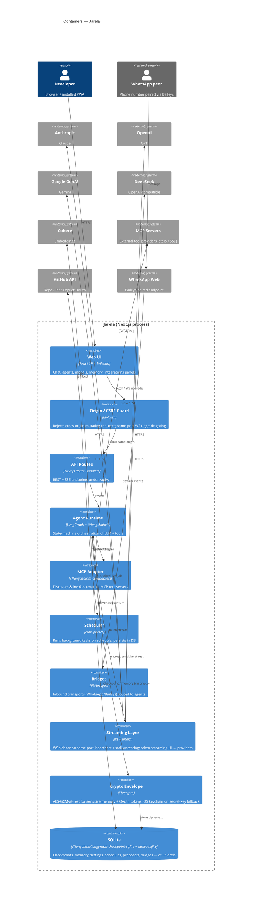
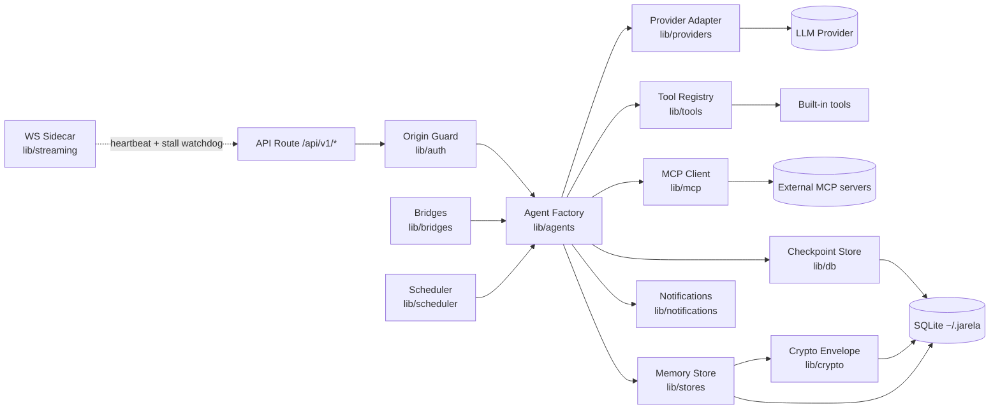
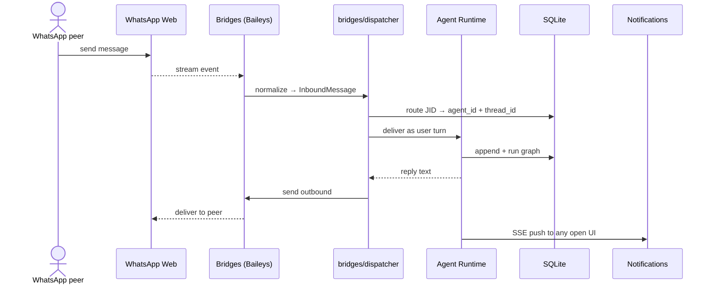
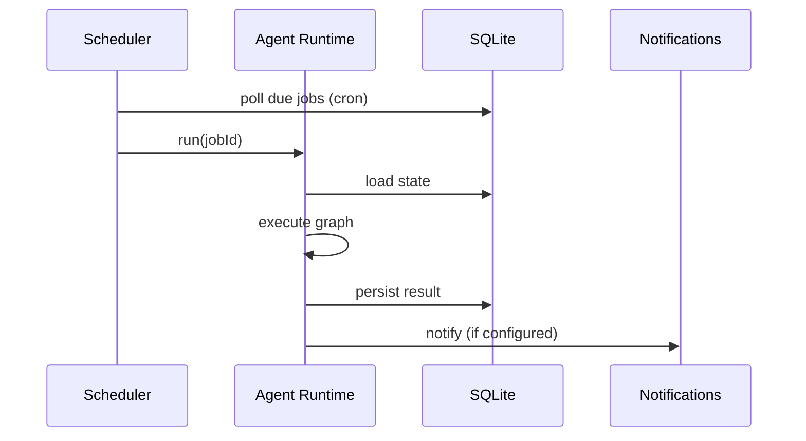

# Architecture — Jarela

## C4 — Container

## C4 — Component (Agent Runtime)

## Key Flow — User sends a chat turn

```mermaid
sequenceDiagram
    actor U as User
    participant UI as Web UI
    participant G as Origin Guard
    participant API as /api/v1/agents/:id/stream
    participant AG as Agent Runtime
    participant DB as SQLite
    participant LLM as LLM Provider

    U->>UI: types message
    UI->>G: POST + WS upgrade
    G->>G: check Origin / Sec-Fetch-Site
    G->>API: forward if same-origin
    API->>AG: invoke(threadId, msg)
    AG->>DB: load checkpoint
    AG->>LLM: stream completion
    LLM-->>AG: tokens
    AG-->>API: token stream
    API-->>UI: SSE / WS tokens
    UI-->>U: render
    AG->>DB: save checkpoint
```

## Key Flow — Inbound bridge message (WhatsApp)

## Key Flow — Scheduled background task

## Non-Functional Requirements

| NFR | Target | Notes |
|---|---|---|
| Cold start (dev) | < 5 s | `npm run dev` |
| First token latency | < 1.5 s p95 | Network-bound on provider |
| Local-only operation | required | No telemetry, no required cloud backend |
| Persistence | survive process restart | All state in `~/.jarela/*.sqlite` |
| API key handling | never leave the host | Stored in DB or env, not synced |
| Same-origin enforcement | required | CSRF / DNS-rebinding guard in `lib/auth/access.ts` |
| Secrets at rest | required for sensitive namespaces | AES-GCM envelope, master key in OS keychain or `.secret-key` fallback |
| WS resilience | reconnect within seconds of network change | Heartbeat + stall watchdog in `lib/streaming/` |
| CI on every push | required | `.github/workflows/ci.yml`: lint + tsc + build + live integration suite |

## External Dependencies

| Dependency | Purpose | Failure mode |
|---|---|---|
| Anthropic / OpenAI / Google / Cohere | LLM inference | Surface provider error to UI; allow model switch |
| MCP servers | External tools | Tool call returns error; agent can recover or skip |
| GitHub API | Repo / PR integration | Feature degrades; chat unaffected |
| SQLite (local) | Persistence | Fatal — startup fails fast with clear error |

## Decisions

See [`docs/adr/`](./docs/adr/). Significant choices on persistence, agent runtime, and provider strategy will be recorded as ADRs.
