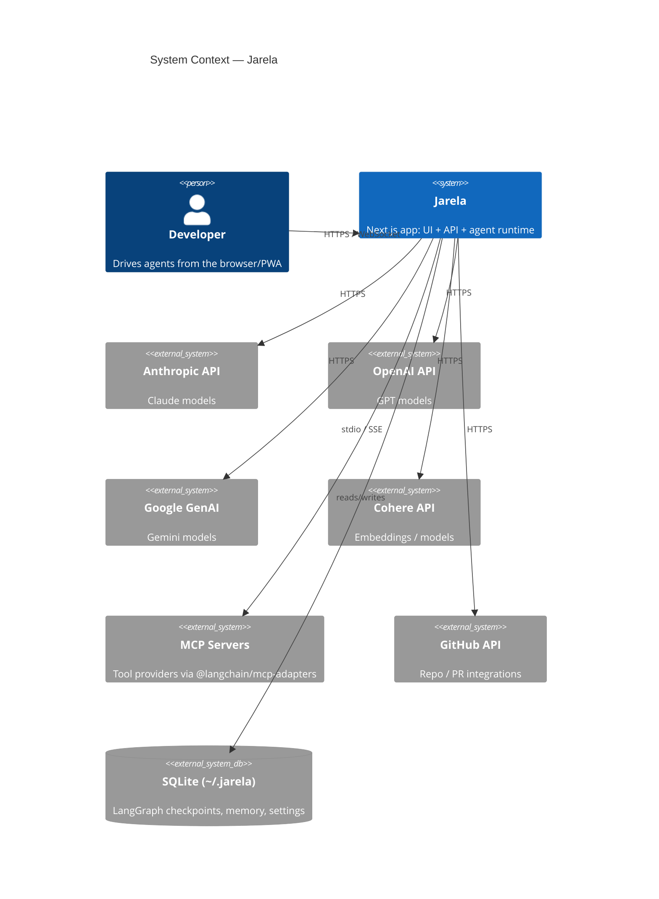

<p align="center">
  
</p>

<h1 align="center">Jarela</h1>

<p align="center">
  <b>A local-first, browser-based GUI for orchestrating multi-provider LLM agents.</b><br/>
  <sub>Next.js 15 + LangGraph + SQLite. PWA-installable. No cloud backend, no telemetry.</sub>
</p>

<p align="center">
  <a href="#quick-start">Quick start</a> ·
  <a href="#features">Features</a> ·
  <a href="#built-in-toolbelt">Tools</a> ·
  <a href="#providers">Providers</a> ·
  <a href="#integrations">Integrations</a> ·
  <a href="#extension-points">Extending</a> ·
  <a href="./ARCHITECTURE.md">Architecture</a>
</p>

<p align="center">
  <a href="https://github.com/andrew-ge-wu/jarela/actions/workflows/ci.yml">
    
  </a>
</p>

---

## What is Jarela?

Jarela is a desktop-grade chat UI for **LangGraph** agents that runs as a
single Next.js process on your own machine. Everything — agent definitions,
model API keys, memory, tool whitelists, scheduled tasks, OAuth tokens,
checkpointed conversation state — lives in SQLite under `~/.jarela`. Talk to
it from any browser, or install it as a PWA / Windows scheduled task and
forget it's there.

It does **not** depend on any hosted backend. The only outbound traffic is to
the LLM / MCP / GitHub providers you explicitly configure.

## Features

### Agent runtime

- **LangGraph state machine** per agent — message history, tool calls, and
  proposals checkpointed to SQLite, so conversations resume across restarts.
- **Streaming** with reasoning blocks (Anthropic extended thinking, OpenAI
  o-series reasoning) over a WebSocket sidecar on the same port as the HTTP
  server.
- **Tool-policy gating per agent** — agents can be locked to a subset of
  tool categories (`Memory`, `Files`, `Shell`, `Web`, `Mail`, …) rather than
  toggling tools one by one.
- **Human-in-the-loop approvals** — high-risk operations can be routed
  through a `propose_config_change` mechanism that surfaces an in-UI banner
  the user must approve before the agent proceeds.

### Persistence & memory

- **Single SQLite store** at `~/.jarela/jarela.db` for settings, agents,
  models, MCP server configs, profile, memory, threads, scheduled tasks,
  proposals, OAuth tokens.
- **Separate LangGraph checkpoint DB** at `~/.jarela/checkpoints.db` (via
  `@langchain/langgraph-checkpoint-sqlite`).
- **Namespaced key/value memory** that the agent reads and writes through
  `memory_read` / `memory_write` / `memory_list`.
- **Vector embeddings** support via a configured embedding provider for
  semantic memory recall.

### Background work

- **Scheduler** (`lib/scheduler/`) runs cron-driven jobs, so an agent can be
  asked to do something hourly/daily without a user in the loop.
- **Bridges** (`lib/bridges/`) let external transports inject messages into
  agent threads. Built-in: **WhatsApp** via Baileys, with a router that maps
  JIDs to specific agents.

### UI

- **PWA** install (`@serwist/next`) — taskbar / home-screen install with the
  full Jarela icon set.
- **iOS-aware layout** — safe-area insets, Dynamic Island padding, location
  sharing, push notification status indicator.
- Panels for **Agents**, **Models**, **MCP servers**, **Integrations**,
  **Memory**, **Profile**, **Bridges**, **Scheduled tasks**, and **Pending
  approvals**.

### Operational

- Runs as a **per-user Windows scheduled task** via
  [scripts/install-to-system.ps1](./scripts/install-to-system.ps1) — auto-starts at logon, logs to
  `%LOCALAPPDATA%\Jarela\logs\app.log`, no admin required.
- Respects standard proxy env vars (`HTTP_PROXY` / `HTTPS_PROXY` /
  `NO_PROXY`) through `undici`'s `EnvHttpProxyAgent`, so it works inside
  corporate networks.

## Quick start

Prerequisites: **Node.js ≥ 22.6** (Node 25 recommended), npm, git.

```bash
git clone https://github.com/andrew-ge-wu/jarela.git
cd jarela
npm install
```

Then pick one launch mode:

### Dev (hot reload)

```bash
npm run dev
# http://localhost:3000
```

### Production one-shot

```bash
npm run build
npm start
# http://localhost:4312
```

### Install as a Windows background task (recommended for daily use)

Per-user scheduled task, auto-starts at logon, no admin required:

```powershell
powershell -ExecutionPolicy Bypass -File scripts\install-to-system.ps1

# manage
Stop-ScheduledTask  -TaskName Jarela
Start-ScheduledTask -TaskName Jarela
Get-Content "$env:LOCALAPPDATA\Jarela\logs\app.log" -Tail 30 -Wait

# uninstall
powershell -ExecutionPolicy Bypass -File scripts\uninstall-from-system.ps1
```

### First-run configuration

API keys can be set in two places:

1. `.env.local` at the repo root (copy from `.env.example`).
2. The **Models** panel in the UI — persisted to `~/.jarela`, takes
   precedence over env vars.

The dev repo and the installed task share the same `~/.jarela`, so you can
configure once and switch between them freely.

## Built-in toolbelt

Tools are LangChain `StructuredTool`s registered in
[lib/tools/index.ts](./lib/tools/index.ts). Every agent has a tool policy
that whitelists which categories are usable.

| Category | Tools | Notes |
| --- | --- | --- |
| **Memory** | `memory_read`, `memory_write`, `memory_list` | Namespaced KV in SQLite |
| **Files** | `file_read`, `file_write`, `file_edit`, `file_move`, `file_copy`, `file_delete`, `file_list`, `file_mkdir`, `file_stat` | Workspace-relative paths under `~/.jarela/files/` |
| **Shell** | `local_exec`, `shell_exec` | Timeouts + deny-list of obviously-destructive patterns |
| **Web** | `web_search` (Tavily), `web_fetch` | HTML-to-text extraction in `web_fetch` |
| **Images** | `generate_image` | Routed through the configured image provider |
| **Schedule** | `schedule_task`, `list_scheduled_tasks`, `cancel_scheduled_task` | Cron strings, computed `next_run_at` |
| **Atlassian** | `jira_search`, `jira_get_issue`, `jira_create_issue`, `jira_add_comment`, `jira_transitions`, `confluence_search`, `confluence_get_page` | Direct REST; works through corporate proxies |
| **Mail** | `gmail_search`, `gmail_get_message`, `gmail_list_labels`, `gmail_modify_message`, `gmail_create_draft`, `gmail_trash_message` | OAuth via `scripts/gmail-oauth.mjs` |
| **Location** | `get_user_location` | Browser geolocation forwarded by the PWA |
| **Config** | `propose_config_change`, `check_proposal` | Human-in-the-loop approval flow |

Any tool exposed by a connected **MCP server** is mounted under the `MCP`
category automatically.

## Providers

Built-in model providers in [lib/providers/](./lib/providers/):

| Provider | Streaming | Tool calling | Notes |
| --- | --- | --- | --- |
| **Anthropic** | yes | yes | Extended thinking blocks |
| **OpenAI** | yes | yes | Reasoning models |
| **Google GenAI** (Gemini) | yes | yes | |
| **DeepSeek** | yes | yes | OpenAI-compatible endpoint |
| **GitHub Copilot** | yes | yes | OAuth device flow ([github-copilot-auth.ts](./lib/providers/github-copilot-auth.ts)) |
| **LangChain bridge** | yes | yes | Generic adapter for anything `langchain` can chat with |

## Integrations

| Integration | Where | How |
| --- | --- | --- |
| **MCP servers** | `MCP` panel | stdio / SSE via `@langchain/mcp-adapters` |
| **GitHub** | `Profile` panel | PAT or Copilot OAuth |
| **Atlassian** (Jira + Confluence) | `Integrations` panel | API token + email |
| **Gmail** | `Integrations` panel | Run `node scripts/gmail-oauth.mjs` once |
| **WhatsApp** | `Bridges` panel | Baileys; pairs a phone, routes JIDs to agents |

## Extension points

### Add an external model provider

Drop a file into `~/.jarela/providers/` (or `$JARELA_DB_DIR/providers/`).
It must `module.exports` an object matching
[lib/providers/types.ts#ModelProvider](./lib/providers/types.ts) — at
minimum:

```js
// ~/.jarela/providers/my-provider.js
module.exports = {
  name: "my-provider",
  async chat({ model, messages, tools, signal }) {
    // return { stream: AsyncIterable<string> } or a final message
  },
};
```

`.js`, `.cjs`, and `.ts` are loaded at startup (`.ts` uses Node ≥ 22.6
type-stripping). ESM `.mjs` files are not — use CommonJS-style exports.
Built-in provider names cannot be overridden.

### Add a built-in tool

1. Copy [lib/tools/template.ts](./lib/tools/template.ts) to `lib/tools/<name>.ts`.
2. Implement with `tool(...)` from `@langchain/core/tools` + a Zod schema.
3. Append the export to `ALL_TOOLS` in [lib/tools/index.ts](./lib/tools/index.ts).
4. If it calls a network or external resource, document the env vars and gate
   it behind a category the user can toggle off.

### Add an MCP server

Use the **MCP** panel in the UI. The config is stored in
`~/.jarela/jarela.db` and reconnected on startup. Tools exposed by the server
appear automatically under the `MCP` category for any agent's tool policy.

### Add a bridge

Implement a transport in `lib/bridges/<name>.ts` that produces normalized
`InboundMessage`s and consumes outbound replies, then wire it into
[lib/bridges/dispatcher.ts](./lib/bridges/dispatcher.ts). The WhatsApp/Baileys
implementation in [lib/bridges/whatsapp.ts](./lib/bridges/whatsapp.ts) is a
working reference.

## Where your data lives

| Path | Contents |
| --- | --- |
| `~/.jarela/jarela.db` | Settings, agents, models, memory, threads, scheduled tasks, proposals, OAuth tokens |
| `~/.jarela/checkpoints.db` | LangGraph state checkpoints |
| `~/.jarela/files/` | Files written by the `file_*` tools |
| `~/.jarela/baileys/` | WhatsApp Baileys auth state |
| `~/.jarela/providers/` | External provider plugins (optional) |
| `%LOCALAPPDATA%\Jarela\logs\app.log` | Installed-task stdout/stderr |

Override the location with `JARELA_DB_DIR=/path/to/dir`. On first launch
against a populated `~/.langgui` (legacy LangGUI install), Jarela renames it
to `~/.jarela` automatically — see [ADR-0005](./docs/adr/0005-rebrand-jarela.md).

## Default ports

| Mode | URL |
| --- | --- |
| `npm run dev` | http://localhost:3000 |
| `npm start` / installed task | http://localhost:4312 |
| WebSocket sidecar | same port, path `/__jarela_ws__` |

## Architecture (C4 context)



See [ARCHITECTURE.md](./ARCHITECTURE.md) for container, component, and
sequence diagrams.

## Development

```bash
npm run dev                  # hot-reload dev server on :3000
npm run build                # production build (standalone output)
npm start                    # serve the standalone build on :4312
npm run lint                 # eslint
npm run test:live            # live integration smoke tests
npm run test:live:full       # extended live test suite
node scripts/gen-logo.mjs    # regenerate the icon set from public/logo-source.png
```

### Task runner

A `make <target>` wrapper is provided for both platforms:

- **macOS / Linux:** [Makefile](./Makefile) — uses GNU make (preinstalled on
  macOS). System install uses launchd (`~/Library/LaunchAgents/com.jarela.app.plist`).
- **Windows:** [make.ps1](./make.ps1) (with a `make.cmd` shim so `make <target>`
  works from cmd / PowerShell without GNU Make). System install uses Task
  Scheduler.

Targets are the same on both:

```bash
make help            # list targets
make install         # npm install
make dev             # dev server
make build           # production build
make start           # serve standalone build
make lint
make test            # live smoke tests
make icons           # regenerate logo / icon set
make install-task    # register auto-start (LaunchAgent on mac, Scheduled Task on Windows)
make start-task      # / stop-task / restart-task
make logs            # tail the installed-task log
make status          # task state + listener on :4312 + data dir
make push            # git push current branch -> jarela remote
make clean           # remove .next + caches
```

Installed-app paths differ by platform:

| Platform | Install dir                                  | Log file                               |
|----------|----------------------------------------------|----------------------------------------|
| macOS    | `~/Library/Application Support/Jarela`       | `~/Library/Logs/Jarela/app.log`        |
| Windows  | `%LOCALAPPDATA%\Programs\Jarela`             | `%LOCALAPPDATA%\Jarela\logs\app.log`   |

Data dir (`~/.jarela`, configurable via `JARELA_DB_DIR`) is the same on both
and is shared between the dev repo and the installed copy.

## Decisions

Architecture decisions are recorded under [docs/adr/](./docs/adr/). Start
with [ADR-0001](./docs/adr/0001-record-architecture-decisions.md). Open a new
ADR before adding a model provider, changing the persistence schema, or
introducing a second process.

## License

No license has been published yet — treat the source as "all rights reserved"
until an explicit `LICENSE` file is added.
