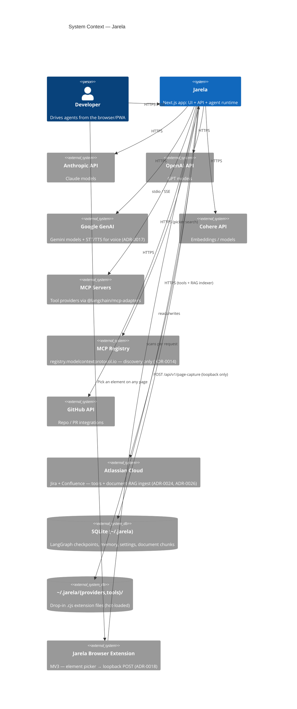

<p align="center">
  
</p>

<h1 align="center">Jarela</h1>

<p align="center">
  <b>A local-first, browser-based GUI for orchestrating multi-provider LLM agents.</b><br/>
  <sub>Next.js 16 + LangGraph + SQLite. PWA-installable. No cloud backend, no telemetry.</sub>
</p>

<p align="center">
  <a href="#quick-start">Quick start</a> ·
  <a href="#configuration-guide-home--work">Config guide</a> ·
  <a href="#supported-platforms">Platforms</a> ·
  <a href="#features">Features</a> ·
  <a href="#productivity-stacks-google--microsoft-at-parity">Google + Microsoft</a> ·
  <a href="#built-in-toolbelt">Tools</a> ·
  <a href="#providers">Providers</a> ·
  <a href="#connections">Connections</a> ·
  <a href="#extension-points">Extending</a> ·
  <a href="./docs/ARCHITECTURE.md">Architecture</a> ·
  <a href="./CONTRIBUTING.md">Contributing</a> ·
  <a href="#documentation">Docs</a>
</p>

<p align="center">
  <a href="https://github.com/CircuitWall/jarela/actions/workflows/ci.yml">
    
  </a>
  <a href="https://github.com/CircuitWall/jarela/actions/workflows/release.yml">
    
  </a>
  <a href="https://www.npmjs.com/package/@circuitwall/jarela">
    
  </a>
  <a href="https://hub.docker.com/r/andrewgewu/jarela">
    
  </a>
  <a href="https://github.com/CircuitWall/jarela/releases/latest">
    
  </a>
  <a href="./LICENSE">
    
  </a>
  <a href="https://nodejs.org/">
    
  </a>
</p>

---

<p align="center">
  <video src="https://github.com/user-attachments/assets/0f33f8d3-07bb-4850-9fcc-cfc97036f180" controls width="640" muted>
    Your browser doesn't support embedded video.
    <a href="https://github.com/user-attachments/assets/0f33f8d3-07bb-4850-9fcc-cfc97036f180">Download the clip</a>.
  </video>
</p>

## Quick start

Get to a working local agent in under 10 minutes:

1. Install using one channel:
  - npm: `npm install -g @circuitwall/jarela`
  - Docker: `docker run -d -p 127.0.0.1:4312:4312 -v jarela-data:/data andrewgewu/jarela`
  - portable archive: download from [Releases](https://github.com/CircuitWall/jarela/releases/latest)
2. Start Jarela:
  - npm install: run `jarela`
  - source checkout: run `npm run dev` (dev) or `npm run build && npm start` (prod)
3. Open the app:
  - dev mode: `http://localhost:3000`
  - installed/prod mode: `http://127.0.0.1:4312`
4. Complete first-run setup:
  - add one provider key (Models/setup screen), then create your first agent
  - enable tool categories that match your workflow (Mail, Calendar, Files, Web, etc.)
5. Optionally connect integrations from Connections:
  - Gmail/Calendar, Outlook/Calendar, GitHub, Atlassian, MCP servers, WhatsApp bridge

For platform-specific install, service/autostart, and operations detail, jump to
[Installation and runtime details](#installation-and-runtime-details).

## Configuration guide (home + work)

This section gives opinionated starter configs and tool chains you can adapt.
Pattern that works well: one agent per lane (home, work), each with a narrow
tool policy and clear trigger source.

### Home setup

Recommended baseline:

- Agent name: `Home assistant`
- Model: low-cost chat model for routine tasks
- Tool categories: `Mail`, `Calendar`, `Web`, `Memory`, `Schedule`
- Bridges: WhatsApp route for family group in `silent_mode` for monitoring, and
  one direct route with replies enabled for active planning

Popular goals and tool chains:

1. Daily family agenda brief
  - Chain: `calendar_list_events` -> `gmail_search`/`outlook_search` -> `memory_write`
  - Result: one morning summary with events + high-priority emails
2. Trip planning helper
  - Chain: `web_search` -> `calendar_create_event` -> `gmail_create_draft`/`outlook_create_draft`
  - Result: compares options, blocks time, drafts confirmation mail
3. Household reminders
  - Chain: `schedule_task` -> `memory_read` -> `calendar_create_event`
  - Result: recurring reminders with memory-backed context

### Work setup

Recommended baseline:

- Agent name: `Work operator`
- Model: stronger reasoning model for cross-system workflows
- Tool categories: `Work` (GitHub + Atlassian), `Mail`, `Calendar`, `Files`, `Documents`, `Schedule`
- Connections: GitHub PAT, Atlassian token, one mail/calendar stack (or both)
- Safety: keep destructive operations behind approvals and draft-first mail policy

Popular goals and tool chains:

1. Standup prep in 5 minutes
  - Chain: `jira_search_issues` -> `github_list_pulls` -> `documents_search` -> `memory_write`
  - Result: compact status grouped by in-progress, blocked, and review-ready
2. Incident follow-up workflow
  - Chain: `github_get_issue`/`jira_get_issue` -> `file_write` (draft runbook notes) -> `outlook_create_draft`/`gmail_create_draft`
  - Result: structured summary plus stakeholder update draft without auto-send
3. Weekly planning and meeting slots
  - Chain: `calendar_list_events` -> `outlook_calendar_create_event`/`calendar_create_event` -> `jira_update_issue`
  - Result: reserves focus blocks and updates ticket state in one pass

### Suggested operating pattern

1. Keep `Home assistant` and `Work operator` separate.
2. Use `silent_mode` on noisy bridge/group channels so the agent reports important events without replying publicly.
3. Prefer watcher/scheduled `script` reactions for deterministic automations; use `agent_prompt` when judgment is required.
4. Store recurring context in memory namespaces (`home/*`, `work/*`) so prompts stay compact.
5. Start with minimal tool categories, then expand only where needed.

## What is Jarela?

Jarela is a desktop-grade chat UI for **LangGraph** agents that runs as a
single Next.js process on your own machine. Everything — agent definitions,
model API keys, memory, tool whitelists, scheduled tasks, OAuth tokens,
checkpointed conversation state — lives in SQLite under the default data dir
(`~/.jarela` on macOS/Linux, `%LOCALAPPDATA%\Jarela` on Windows). Talk to it
from any browser, or install it as a PWA / Windows scheduled task and forget
it's there.

It does **not** depend on any hosted backend. The only outbound traffic is to
the LLM / MCP / GitHub providers you explicitly configure.

> **Runs on Windows, macOS, and Linux.** Everything is plain Node.js +
> SQLite — no native installer, no platform-locked dependencies. Windows
> ships with a per-user Scheduled Task supervisor; macOS and Linux run
> under launchd / systemd (or any process supervisor you prefer).

> **Dual productivity-stack support.** Jarela treats the **Google**
> (Gmail + Calendar) and **Microsoft** (Outlook + Calendar) ecosystems as
> first-class, parity peers — same in-UI OAuth, same tool surface, same
> safety policy. Pick one, or connect both and let your agents bridge them.

## Features

### Agent runtime

- **LangGraph state machine** per agent — message history, tool calls, and
  proposals checkpointed to SQLite, so conversations resume across restarts.
- **Streaming** with reasoning blocks (Anthropic extended thinking, OpenAI
  o-series reasoning) over Server-Sent Events. One POST submits a turn,
  one EventSource subscribes to the chunk stream — see ADR-0008. The same
  port serves UI, API, and stream; no WebSocket sidecar.
- **Tool-policy gating per agent** — agents can be locked to a subset of
  tool categories (`Memory`, `Files`, `Shell`, `Web`, `Mail`, `Calendar`, …)
  rather than toggling tools one by one.
- **Human-in-the-loop approvals** — high-risk operations can be routed
  through a `propose_config_change` mechanism that surfaces an in-UI banner
  the user must approve before the agent proceeds.
- **Adaptive persona** — per-agent MBTI preset (Architect, Campaigner, …)
  combined with empathy / expressiveness / verbosity sliders, mixed with a
  per-turn signal detector (frustrated / rushed / positive) to shape the
  system prompt deterministically. Off by default.
- **Voice** — per-agent push-to-talk via Gemini STT, plus a
  `generate_voice` tool that produces audio clips (rendered inline in the
  chat). Requires a Google API key; chat works without it. See ADR-0017.

### Persistence & memory

- **Single SQLite store** at `~/.jarela/jarela.db` for settings, agents,
  models, MCP server configs, profile, memory, threads, scheduled tasks,
  proposals, OAuth tokens.
- **Separate LangGraph checkpoint DB** at `~/.jarela/checkpoints.db` (via
  `@langchain/langgraph-checkpoint-sqlite`).
- **Namespaced key/value memory** that the agent reads and writes through
  `memory_read` / `memory_write` / `memory_list`.
- **Vector embeddings** support via a configured embedding provider for
  semantic memory recall.

### Background work

- **Scheduler** (`lib/scheduler/`) runs cron-driven jobs, so an agent can be
  asked to do something hourly/daily without a user in the loop.
- **Bridges** (`lib/bridges/`) let external transports inject messages into
  agent threads. Built-in: **WhatsApp** via Baileys, with a router that maps
  JIDs to specific agents.

### Productivity stacks (Google + Microsoft, at parity)

Jarela ships matched tool sets for both major consumer/enterprise
productivity ecosystems. Connect one or both — the agent surface and
safety policy are identical.

|  | Google | Microsoft |
| --- | --- | --- |
| **Mail** | Gmail (`gmail_*` tools) | Outlook (`outlook_*` tools) |
| **Calendar** | Google Calendar (`calendar_*` tools) | Outlook Calendar (`outlook_calendar_*` tools) |
| **Meetings** | Auto-attach **Google Meet** links | Auto-attach **Microsoft Teams** links |
| **Auth** | In-app Google OAuth | In-app Microsoft OAuth (Azure app registration) |
| **Account types** | Personal + Workspace | Personal (`@outlook.com`) + work/school (Entra ID) |
| **Mail policy** | Read / search / **draft only** — no auto-send | Read / search / **draft only** — no auto-send |
| **Calendar policy** | Full read / write / delete | Full read / write / delete |
| **Setup** | In-app **Connect Gmail** button | In-app **Connect Outlook** button |

Both flows store refresh tokens encrypted at rest under `~/.jarela`. There
is no preferred stack — an agent with both connected can search Gmail and
create an Outlook Calendar invite in the same turn.

### UI

- **PWA** install (`@serwist/next`) — taskbar / home-screen install with the
  full Jarela icon set.
- **iOS-aware layout** — safe-area insets, Dynamic Island padding, location
  sharing, push notification status indicator.
- Panels for **Agents**, **Models**, **Connections**, **Tools**,
  **Memory**, **Documents**, **Profile**, **Bridges**, **Scheduled tasks**,
  and **Pending approvals**.
- **Browser extension** ([`browser-extension/`](./browser-extension)) —
  Chrome MV3, click an element on any page and POST it to your local
  Jarela as a new user message (ADR-0018). Loopback only; toolbar icon
  greys out when Jarela isn't running.

### Operational

- **Cross-platform** — single Node.js process, runs on Windows, macOS, and
  Linux. Per-OS supervisor recipes below.
- Runs as a **per-user Windows scheduled task** via
  [scripts/install-to-system.ps1](./scripts/install-to-system.ps1) — auto-starts at logon, logs to
  `%LOCALAPPDATA%\Jarela\logs\app.log`, no admin required.
- On **macOS** runs cleanly under `launchd` (LaunchAgent plist); on
  **Linux** under `systemd --user`. Sample units below.
- Respects standard proxy env vars (`HTTP_PROXY` / `HTTPS_PROXY` /
  `NO_PROXY`) through `undici`'s `EnvHttpProxyAgent`, so it works inside
  corporate networks. **On macOS**, set proxy mode to **System** in
  Settings → Connections → Built-in integrations → Network and Jarela
  auto-discovers the proxy (via `scutil --proxy`) and trust store (via `security
  find-certificate` against System + login keychains, written to
  `~/.jarela/system-ca.pem`) — zero shell-config or manual CA paste
  required when the corporate roots are already in the system keychain
  (ADR-0020).

## Installation and runtime details

Works on **Windows 10/11**, **macOS 12+**, and **Linux** (any modern glibc
distro). See [Supported platforms](#supported-platforms) for the per-OS
file layout.

### Install (no source checkout needed)

Three pre-built release channels — pick the one that matches your host.
All three end at the same place: a local Next.js process on
`http://127.0.0.1:4312`, all state under the default host data dir
(`~/.jarela` on macOS/Linux, `%LOCALAPPDATA%\Jarela` on Windows) or a named
Docker volume. See [INSTALL.md](./docs/INSTALL.md) for first-launch warnings
and uninstall steps, and
[ADR-0011](./docs/adr/0011-distribute-via-portable-archives-and-npm.md)
for why multiple paths exist.

| Channel | Best for | Install command | Updates |
|---|---|---|---|
| **GitHub Releases** (portable archive) | Air-gapped boxes, no Node toolchain | Download `jarela-<ver>-<os>.{tar.gz,zip}` from [Releases](https://github.com/CircuitWall/jarela/releases/latest), extract, run the install script with `--skip-build` | re-download next tag |
| **npm** (`@circuitwall/jarela`) | Any host with Node ≥ 22 — global CLI, OS-native autostart | `npm install -g @circuitwall/jarela` | `npm update -g @circuitwall/jarela` |
| **Docker Hub** (`andrewgewu/jarela`) | Linux server, NAS, container host | `docker run -d -p 127.0.0.1:4312:4312 -v jarela-data:/data andrewgewu/jarela` | `docker pull andrewgewu/jarela` |

**A. Download a release archive** (no Node required to install — bundle is
self-contained):

| OS      | Asset                                |
|---------|--------------------------------------|
| macOS   | `jarela-<version>-darwin.tar.gz`     |
| Windows | `jarela-<version>-win.zip`           |
| Linux   | `jarela-<version>-linux.tar.gz`      |

Extract, then run the install script with `--skip-build` / `-SkipBuild` —
the bundle ships a pre-built `.next/standalone/` tree.

**B. From npm** (Node ≥ 22 required):

```bash
npm install -g @circuitwall/jarela
jarela                # starts the bundled standalone server immediately
jarela install-service   # optional: register OS-native autostart (per-user, no admin)
```

Releases on npm are published from GitHub Actions via
[npm Trusted Publishing](https://docs.npmjs.com/trusted-publishers) (OIDC) and ship
with [provenance attestations](https://docs.npmjs.com/generating-provenance-statements)
signed to the sigstore transparency log — no long-lived `NPM_TOKEN` ever
touches a release.

**C. From Docker Hub** (Linux host with Docker ≥ 20.10):

```bash
docker run -d --name jarela \
  -p 127.0.0.1:4312:4312 \
  -v jarela-data:/data \
  -e JARELA_DB_DIR=/data \
  andrewgewu/jarela
```

Or with `docker compose`:

```bash
curl -fsSL https://raw.githubusercontent.com/CircuitWall/jarela/main/docker-compose.yml -o docker-compose.yml
docker compose up -d
```

Tags: `latest`, `0`, `0.1`, `0.1.3`, … (semver-stepped). See
[INSTALL.md → Path 3](./docs/INSTALL.md#path-3--docker-ubuntu--linux) for
the full Docker recipe.

### Or from source (developers)

Prerequisites: **Node.js ≥ 22.6** (Node 25 recommended), npm, git.

```bash
git clone https://github.com/CircuitWall/jarela.git
cd jarela
npm install
```

### First launch — one key, then chat

The very first time the app starts with no `model_configs` row, it routes
to a single setup screen asking for **one** LLM provider key. Validate,
save, done — every subsequent integration (Gmail, Outlook, Atlassian, …)
is driven by chatting with the agent, which proposes the credential
collection through the existing approval rail. Secrets are typed into the
approval modal directly; the agent never sees them. See
[ADR-0010](./docs/adr/0010-agent-led-setup-and-integration-manifests.md).

Then pick one launch mode:

### Dev (hot reload)

```bash
npm run dev
# http://localhost:3000
```

### Production one-shot

```bash
npm run build   # next build (output=standalone) + hydrate static/public
npm start       # node .next/standalone/server.js with PORT=4312
# http://localhost:4312
```

`npm run build` writes a self-contained bundle to `.next/standalone/` —
copy that directory anywhere you want to run Jarela without the source
checkout. `npm start` is just a thin wrapper around `node server.js` with
PORT/HOSTNAME defaults applied.

### Configuration

All runtime knobs are resolved once at startup via `lib/env/config.ts`.
Set them in `.env.local` (see [`.env.example`](.env.example)) or export
them in your shell / service unit:

| Var                       | Default                | Purpose                                           |
| ------------------------- | ---------------------- | ------------------------------------------------- |
| `JARELA_PORT` / `PORT`    | `4312`                 | TCP port                                          |
| `JARELA_HOSTNAME` / `HOSTNAME` | `127.0.0.1`       | Bind address                                      |
| `JARELA_DB_DIR`           | `~/.jarela` (Win: `%LOCALAPPDATA%\Jarela`) | SQLite + generated files dir |
| `JARELA_TOOLS_DIR`        | `$JARELA_DB_DIR/tools` | External tool plugins (CJS/TS) loaded at startup  |
| `JARELA_RECURSION_LIMIT`  | `200`                  | Max LangGraph steps per agent run                 |
| `JARELA_VOICE_TIMEOUT_MS` | `60000`                | Gemini voice (TTS/STT) request timeout            |
| `JARELA_IMAGE_TIMEOUT_MS` | `60000`                | Gemini image-generation request timeout           |
| `JARELA_UPDATE_CHANNEL`   | `stable`               | `stable` (npm `latest`) or `main` (GitHub `main`, experimental) |
| `JARELA_DISABLE_UPDATE_CHECK` | _(unset)_          | Set to `1` to skip the daily update probe         |
| `JARELA_ENABLE_MOCK_PROVIDER` | _(unset)_          | Set to `1` to register the `mock` LLM provider (tests / offline dev) |
| `JARELA_TOOL_SAFETY`      | `mostly_safe`          | Built-in `exec` + `file_*` guard tier. `safe` = read-only inspection commands, no filesystem writes. `mostly_safe` = blocks the obvious destructive patterns (`rm -rf /`, `shutdown`, fork bomb, credential dirs, `~/.jarela`). `bypass` = every guard off (trusted local use only). |
| `JARELA_ALLOW_SENSITIVE_FILES` | _(unset)_         | Set to `1` to override the credential-path denylist under `mostly_safe`. |
| `NEXT_PUBLIC_APP_NAME`    | `Jarela`               | User-visible app name (browser tab, sidebar, agent system prompt). Forks override to rebrand without source patches. |
| `NEXT_PUBLIC_APP_DESCRIPTION` | `Jarela — local chat interface for LangGraph agents` | `<meta name="description">` for the HTML head. |
| `NEXT_PUBLIC_APP_ISSUE_URL` | `https://github.com/CircuitWall/jarela/issues/new` | "Report a bug" target. Forks point this at their own tracker. |

`JARELA_*` takes precedence over the legacy `PORT` / `HOSTNAME` names.

#### Update channels

On startup and via `GET /api/v1/update`, Jarela checks once a day whether
newer code is available. Two tracks:

- **`stable`** (default) — polls npm for the latest published version of
  `@circuitwall/jarela`. `jarela update` runs `npm i -g
  @circuitwall/jarela@latest`.
- **`main`** (experimental) — polls the tip commit of the `main` branch on
  GitHub. For source checkouts the comparison is by commit SHA and
  `jarela update` does `git pull --ff-only && npm i && npm run build`. For
  npm installs it falls back to comparing the `main` branch's
  `package.json` version and installs via
  `npm i -g github:CircuitWall/jarela#main`.

Set `JARELA_DISABLE_UPDATE_CHECK=1` to silence the probe entirely.

#### Mock LLM provider (testing / offline dev)

Set `JARELA_ENABLE_MOCK_PROVIDER=1` to register a deterministic `mock`
provider in the registry. With the flag set, configure an agent with
`provider: "mock"` (any `model` id works) and Jarela will reply locally
without making network calls. Behaviour is scripted via directives in the
last user message:

| Directive | Effect |
|---|---|
| `MOCK:reply=<text>` | stream back exactly `<text>` |
| `MOCK:echo` | echo the user message verbatim |
| `MOCK:tool=<name>:<json-args>` | emit one tool call (e.g. `MOCK:tool=web_search:{"q":"foo"}`) |
| `MOCK:think=<text>` | emit a thinking delta before the text |
| `MOCK:slow=<ms>` | sleep `<ms>` between word chunks |
| `MOCK:error=<msg>` | throw `<msg>` |
| `MOCK:stop=<reason>` | override stop_reason (`stop` / `tool_use` / `length`) |

Embeddings are deterministic 384-dim L2-normalised vectors seeded by
SHA-256 of the input, so semantic-recall tests have stable rankings. The
flag is opt-in so production deployments never expose `mock` as a
selectable backend.

### Install as a background service

Jarela is a single long-running Node process. Use whatever supervisor your
OS provides; the repo ships a turn-key installer for Windows, and the
recipes below cover macOS + Linux.

#### Windows — per-user scheduled task (turn-key)

Auto-starts at logon, no admin required:

```powershell
powershell -ExecutionPolicy Bypass -File scripts\install-to-system.ps1

# manage
Stop-ScheduledTask  -TaskName Jarela
Start-ScheduledTask -TaskName Jarela
Get-Content "$env:LOCALAPPDATA\Jarela\logs\app.log" -Tail 30 -Wait

# uninstall
powershell -ExecutionPolicy Bypass -File scripts\uninstall-from-system.ps1
```

#### macOS — LaunchAgent

Drop a plist at `~/Library/LaunchAgents/com.jarela.plist`:

```xml
<?xml version="1.0" encoding="UTF-8"?>
<!DOCTYPE plist PUBLIC "-//Apple//DTD PLIST 1.0//EN" "http://www.apple.com/DTDs/PropertyList-1.0.dtd">
<plist version="1.0">
<dict>
  <key>Label</key><string>com.jarela</string>
  <key>ProgramArguments</key>
  <array>
    <string>/usr/local/bin/node</string>
    <string>/path/to/jarela/.next/standalone/server.js</string>
  </array>
  <key>EnvironmentVariables</key>
  <dict>
    <key>PORT</key><string>4312</string>
    <key>HOSTNAME</key><string>127.0.0.1</string>
  </dict>
  <key>RunAtLoad</key><true/>
  <key>KeepAlive</key><true/>
  <key>StandardOutPath</key><string>/tmp/jarela.log</string>
  <key>StandardErrorPath</key><string>/tmp/jarela.log</string>
</dict>
</plist>
```

Load it:

```bash
launchctl load -w ~/Library/LaunchAgents/com.jarela.plist
launchctl list | grep jarela
```

#### Linux — systemd user unit

Drop a unit at `~/.config/systemd/user/jarela.service`:

```ini
[Unit]
Description=Jarela
After=network-online.target

[Service]
Type=simple
WorkingDirectory=%h/jarela
ExecStart=/usr/bin/node %h/jarela/.next/standalone/server.js
Environment=PORT=4312 HOSTNAME=127.0.0.1
Restart=always
RestartSec=3

[Install]
WantedBy=default.target
```

Enable it:

```bash
systemctl --user daemon-reload
systemctl --user enable --now jarela.service
journalctl --user -u jarela -f
```

### Supported platforms

| OS | Status | Data dir (default) | Supervisor |
| --- | --- | --- | --- |
| **Windows 10/11** | first-class | `%LOCALAPPDATA%\Jarela` (ADR-0006, OneDrive-safe) | Scheduled Task (`scripts\install-to-system.ps1`) |
| **macOS 12+** (Intel + Apple Silicon) | supported | `~/.jarela` | `launchd` LaunchAgent (sample plist above) |
| **Linux** (Ubuntu / Debian / Fedora / Arch) | supported | `~/.jarela` | `systemd --user` unit (sample above) |
| **WSL2** | supported | `~/.jarela` inside the distro | `systemd --user` if the distro has it, else any supervisor |

Any OS: override the data directory with `JARELA_DB_DIR=/some/path`.
Nothing in the codebase shells out to platform-specific binaries at
runtime — file paths, process spawning, and SQLite all use Node's
cross-platform APIs.

### First-run configuration

API keys can be set in two places:

1. `.env.local` at the repo root (copy from `.env.example`).
2. The **Models** panel in the UI — persisted to `~/.jarela`, takes
   precedence over env vars.

The dev repo and the installed task share the same `~/.jarela`, so you can
configure once and switch between them freely.

## Built-in toolbelt

Tools are LangChain `StructuredTool`s registered in
[lib/tools/index.ts](./lib/tools/index.ts). Every agent has a tool policy
that whitelists which categories are usable.

| Category | Tools | Notes |
| --- | --- | --- |
| **Memory** | `memory_read`, `memory_write`, `memory_list` | Namespaced KV in SQLite |
| **Documents** | `documents_search`, `documents_list_sources` | Semantic recall over folders the user added under the Documents tab. Cosine over chunked text; substring fallback when no embedding provider is configured. See [ADR-0024](docs/adr/0024-document-rag.md). |
| **Files** | `file_read`, `file_write`, `file_edit`, `file_move`, `file_copy`, `file_delete`, `file_list`, `file_mkdir`, `file_stat` | Workspace-relative paths under `~/.jarela/files/` |
| **Shell** | `local_exec`, `shell_exec` | Timeouts + deny-list of obviously-destructive patterns |
| **Web** | `web_search` (Tavily), `web_fetch` | HTML-to-text extraction in `web_fetch` |
| **Images** | `generate_image` | Routed through the configured image provider |
| **Schedule** | `schedule_task`, `list_scheduled_tasks`, `cancel_scheduled_task`, `schedule_watcher`, `list_watchers`, `cancel_watcher` | Cron + ISO scheduling, event-driven watchers (ADR-0027) |
| **Work › Atlassian** | **Jira issues**: search, get, create (incl. bulk), update, transition, link, comments CRUD, worklogs, attachments (upload/download/delete), changelog, delete.<br/>**Jira agile**: list/get boards, list/get/create/update/delete sprints (with state-machine validation), move issues to sprint or backlog, rank.<br/>**Jira project metadata**: list projects, get project (with versions/components/issue-types expand), CRUD versions, CRUD components, list issue-types/priorities/statuses/resolutions.<br/>**Confluence**: search, page CRUD + delete + move, comments (list/add/update/delete, footer + inline), attachments (upload/list/download/delete), labels (add/remove), spaces. | Direct REST; works through corporate proxies. Sprint operations cover the full ceremony (create → start → complete). Destructive ops (delete sprint, purge page, purge attachment) require a `confirm` arg matching the id. `jira_get_issue`/`jira_update_issue` accept `custom_fields` by display name or `customfield_*` id. See [ADR-0035](docs/adr/0035-comprehensive-atlassian-coverage.md) for the full inventory and rationale. |
| **Work › Jira Align** | **Work items**: get, search, list children, create, update, transition, delete (per-type routing for epic/capability/feature/story/theme/task/defect/objective).<br/>**Hierarchy**: list / get programs, teams, releases, sprints (PIs), portfolios, value streams. | Direct REST against `*.jiraalign.com`. Bearer-token auth. Hierarchy tools resolve human names → ids without leaving the agent. See [ADR-0019](docs/adr/0019-jira-align-tool.md), [ADR-0021](docs/adr/0021-jira-align-type-aware-routing.md), [ADR-0035](docs/adr/0035-comprehensive-atlassian-coverage.md). |
| **Work › GitHub** | `github_search_issues`, `github_get_issue`, `github_create_issue`, `github_add_comment`, `github_list_pulls`, `github_get_pull`, `github_get_repo` | Direct REST against `api.github.com`; PAT auth via env or Connections → Built-in integrations ([ADR-0015](docs/adr/0015-native-github-tools.md)). |
| **Mail** | **Google:** `gmail_search`, `gmail_get_message`, `gmail_list_labels`, `gmail_modify_message`, `gmail_create_draft`, `gmail_trash_message`<br/>**Microsoft:** `outlook_search`, `outlook_get_message`, `outlook_list_folders`, `outlook_modify_message`, `outlook_create_draft`, `outlook_trash_message` | Read/search/draft only on both providers — no auto-send. Gmail via Google OAuth, Outlook via Microsoft Graph. |
| **Calendar** | **Google:** `calendar_list_calendars`, `calendar_list_events`, `calendar_get_event`, `calendar_create_event`, `calendar_update_event`, `calendar_delete_event`<br/>**Microsoft:** `outlook_calendar_list_calendars`, `outlook_calendar_list_events`, `outlook_calendar_get_event`, `outlook_calendar_create_event`, `outlook_calendar_update_event`, `outlook_calendar_delete_event` | Full read/write on both. Outlook variant can provision Teams meetings; Google variant can provision Google Meet. |
| **Location** | `get_user_location` | Browser geolocation forwarded by the PWA |
| **Config** | `propose_config_change`, `check_proposal` | Human-in-the-loop approval flow |

Any tool exposed by a connected **MCP server** is mounted under the `MCP`
category automatically.

## Providers

Built-in model providers in [lib/providers/](./lib/providers/):

| Provider | Streaming | Tool calling | Notes |
| --- | --- | --- | --- |
| **Anthropic** | yes | yes | Extended thinking blocks |
| **OpenAI** | yes | yes | Reasoning models |
| **Google GenAI** (Gemini) | yes | yes | |
| **DeepSeek** | yes | yes | OpenAI-compatible endpoint |
| **GitHub Copilot** | yes | yes | OAuth device flow ([github-copilot-auth.ts](./lib/providers/github-copilot-auth.ts)) |
| **LangChain bridge** | yes | yes | Generic adapter for anything `langchain` can chat with |

## Connections

Jarela ships first-class support for **both the Google and Microsoft
productivity stacks** — each with parity coverage for mail + calendar via
the same in-UI OAuth flow:

| Integration | Where | How |
| --- | --- | --- |
| **MCP servers** | `Connections → MCP servers` | stdio / SSE via `@langchain/mcp-adapters`. Search the official [MCP Registry](https://registry.modelcontextprotocol.io/) or paste a custom command. |
| **GitHub Copilot** (model provider) | `Profile` panel | OAuth device flow |
| **GitHub** (issues + PRs) | `Connections → Built-in integrations` | Personal Access Token (`repo` + optional `read:org`); used by `github_*` tools ([ADR-0015](docs/adr/0015-native-github-tools.md)) |
| **Atlassian** (Jira + Confluence) | `Connections → Built-in integrations` | API token + email |
| **Google** (Gmail + Calendar) | `Connections → Built-in integrations` | In-app Google OAuth — click **Connect Gmail**, approve, done. Scopes: `gmail.modify` (drafts only, no send) + `calendar.events`. |
| **Microsoft** (Outlook + Calendar) | `Connections → Built-in integrations` | In-app Microsoft OAuth via Azure app registration — click **Connect Outlook**, approve, done. Scopes: `Mail.ReadWrite` + `Calendars.ReadWrite` + `offline_access`. Works with personal (`@outlook.com`) and work/school accounts. |
| **WhatsApp** | `Bridges` panel | Baileys; pairs a phone, routes JIDs to agents |

Each first-class integration ships a machine-readable manifest at
`lib/integrations/<id>/manifest.ts` (prerequisites + ordered steps +
troubleshooting). The agent reads these via the `list_integrations` /
`get_integration_setup` tools and walks the user through enabling them
without anyone touching the Connections tab by hand. New integrations
must include a manifest — `npm run lint` enforces it.

## Extension points

External providers and tools are **hot-loaded**: drop a `.cjs` file in the
right directory, save, and the next chat picks it up — no restart. Loaded
extensions and any validation errors show up under the **Extensions** tab in
the menu (also at `GET /api/v1/extensions`). Contract is pinned in
[ADR-0013](./docs/adr/0013-external-extension-contract.md).

### Add an external model provider

Copy [lib/providers/template-external.cjs.example](./lib/providers/template-external.cjs.example)
to `~/.jarela/providers/<name>.cjs` (or `$JARELA_DB_DIR/providers/<name>.cjs`).
Must `module.exports` an object matching
[lib/providers/types.ts#ModelProvider](./lib/providers/types.ts) — at minimum:

```js
// ~/.jarela/providers/my-provider.cjs
module.exports = {
  name: "my-provider",
  async chat(model_id, messages, params) {
    // return { stream: AsyncIterable<string> }
  },
};
```

Optional advanced hooks for fuller native exposure:

- `invoke(model_id, messages, params, tools)` for non-stream tool calls
- `streamInvoke(model_id, messages, params, tools)` for token/tool/thinking streams
- `embed(model_id, inputs, params)` for semantic recall
- `listModels(params)` so the Models UI can show this provider's catalog

`chat()` now receives multipart content too (`string | ContentPart[]`), so
external providers can implement native vision/files paths without using
`invoke()` first.

`.js`, `.cjs`, and `.ts` are accepted (`.ts` uses Node ≥ 22.6 type-stripping).
ESM `.mjs` files are not — use CommonJS exports. Built-in provider names cannot
be overridden.

### Add an external tool

Copy [lib/tools/template-external.cjs.example](./lib/tools/template-external.cjs.example)
to `~/.jarela/tools/<name>.cjs`. No `langchain` or `zod` imports — Jarela wraps
your plain object:

```js
// ~/.jarela/tools/weather.cjs
module.exports = {
  name: "weather",
  description: "Get weather for a city.",
  category: "Web",
  // Optional: declare secret slots editable in the Extensions panel.
  // Values are AES-256-GCM encrypted at rest (ADR-0023) and read at
  // runtime via ctx.getSecret(). Each tool sees only its own slots.
  secrets: [
    { key: "api_key", label: "OpenWeather API key", required: true },
  ],
  schema: {
    type: "object",
    properties: { city: { type: "string" } },
    required: ["city"],
  },
  async run({ city }, ctx) {
    const apiKey = ctx.getSecret("api_key");
    if (!apiKey) throw new Error("Configure 'api_key' under Extensions → weather.");
    const r = await fetch(`https://api.openweathermap.org/data/2.5/weather?q=${city}&appid=${apiKey}`);
    return await r.json();
  },
};
```

Names that collide with built-in tools are rejected (built-in wins). Throw an
`Error` to signal failure — the agent receives the message.

### Add a built-in tool (in-tree)

1. Copy [lib/tools/template.ts](./lib/tools/template.ts) to `lib/tools/<name>.ts`.
2. Implement with `tool(...)` from `@langchain/core/tools` + a Zod schema.
3. Call `registerTools("<Category>", [yourTool, ...])` at the bottom of the file.
4. Add `import "./<name>";` to [lib/tools/builtins.ts](./lib/tools/builtins.ts).
5. If it calls a network or external resource, document the env vars and gate
   it behind a category the user can toggle off.

### Add an MCP server

Use **Connections → MCP servers** in the UI. The picker searches the official
[MCP Registry](https://registry.modelcontextprotocol.io/) live (ADR-0014);
results are translated into install templates with prompts for any required
env vars or tokens. The config is stored in `~/.jarela/jarela.db` and
reconnected on startup. Tools exposed by the server appear automatically
under the `MCP` category for any agent's tool policy.

### Add a bridge

Implement a transport in `lib/bridges/<name>.ts` that produces normalized
`InboundMessage`s and consumes outbound replies, then wire it into
[lib/bridges/dispatcher.ts](./lib/bridges/dispatcher.ts). The WhatsApp/Baileys
implementation in [lib/bridges/whatsapp.ts](./lib/bridges/whatsapp.ts) is a
working reference.

### Trust model for external code

External providers and tools run **in-process** with the same Node privileges
as the rest of the app — same trust level as a locally-spawned MCP server.
Only drop in code you wrote or trust. There is no sandbox.

## Where your data lives

| Path | Contents |
| --- | --- |
| `~/.jarela/jarela.db` | Settings, agents, models, memory, threads, scheduled tasks, proposals, OAuth tokens |
| `~/.jarela/checkpoints.db` | LangGraph state checkpoints |
| `~/.jarela/files/` | Files written by the `file_*` tools |
| `~/.jarela/baileys/` | WhatsApp Baileys auth state |
| `~/.jarela/providers/` | External provider plugins, hot-loaded (optional) |
| `~/.jarela/tools/` | External tool plugins, hot-loaded (optional) |
| `%LOCALAPPDATA%\Jarela\logs\app.log` | Installed-task stdout/stderr |

Override the location with `JARELA_DB_DIR=/path/to/dir`. On first launch
against a populated `~/.langgui` (legacy LangGUI install), Jarela renames it
to `~/.jarela` automatically — see [ADR-0005](./docs/adr/0005-rebrand-jarela.md).

## Default ports

| Mode | URL |
| --- | --- |
| `npm run dev` | http://localhost:3000 |
| `npm start` / installed task | http://localhost:4312 |

## Remote access via Tailscale

Jarela is a single-port HTTPS-or-HTTP app — no WebSocket sidecar,
no separate streaming port (see
[ADR-0008](./docs/adr/0008-cqrs-run-submit-eventsource.md)). The
recommended way to reach an installed Jarela from your phone or
another machine is `tailscale serve`, which terminates HTTPS at
your tailnet name and forwards to plain HTTP on loopback.

Helper scripts (Windows):

```powershell
# Configure tailscale serve for the installed Jarela on :4312
powershell -ExecutionPolicy Bypass -File scripts\install-tailscale-serve.ps1

# Clear it again
powershell -ExecutionPolicy Bypass -File scripts\uninstall-tailscale-serve.ps1
```

`scripts\install-to-system.ps1` invokes the install helper automatically
at the end of an install; pass `-SkipTailscale` to opt out.
`scripts\uninstall-from-system.ps1` resets the serve config on uninstall;
pass `-KeepTailscale` to leave it in place.

Live status, the exact recipe, and a copy button are also surfaced in
**Settings → You → Tailscale serve** in the UI.

Remote tailnet users still need to be whitelisted under
**Settings → You → Tailscale access whitelist** — local loopback is
always allowed, but anything reaching the node through the
`Tailscale-User-Login` header must match an entry.

## Architecture (C4 context)



See [ARCHITECTURE.md](./docs/ARCHITECTURE.md) for the **design principles &
scope boundaries** that govern new work, plus container, component, and
sequence diagrams.

## Development

```bash
npm run dev                  # hot-reload dev server on :3000
npm run build                # production build (standalone output)
npm start                    # serve the standalone build on :4312
npm run lint                 # eslint
npm run test:live            # live integration smoke tests
npm run test:live:full       # extended live test suite
node scripts/gen-logo.mjs    # regenerate the icon set from public/logo-source.png
```

### Task runner

A `make <target>` wrapper is provided for both platforms:

- **macOS / Linux:** [Makefile](./Makefile) — uses GNU make (preinstalled on
  macOS). System install uses launchd (`~/Library/LaunchAgents/com.jarela.app.plist`).
- **Windows:** [make.ps1](./make.ps1) (with a `make.cmd` shim so `make <target>`
  works from cmd / PowerShell without GNU Make). System install uses Task
  Scheduler.

Targets are the same on both:

```bash
make help            # list targets
make install         # npm install
make dev             # dev server
make build           # production build
make start           # serve standalone build
make lint
make test            # live smoke tests
make icons           # regenerate logo / icon set
make install-task    # register auto-start (LaunchAgent on mac, Scheduled Task on Windows)
make start-task      # / stop-task / restart-task
make logs            # tail the installed-task log
make status          # task state + listener on :4312 + data dir
make push            # git push current branch -> jarela remote
make clean           # remove .next + caches
```

Installed-app paths differ by platform:

| Platform | Install dir                                  | Log file                               |
|----------|----------------------------------------------|----------------------------------------|
| macOS    | `~/Library/Application Support/Jarela`       | `~/Library/Logs/Jarela/app.log`        |
| Windows  | `%LOCALAPPDATA%\Programs\Jarela`             | `%LOCALAPPDATA%\Jarela\logs\app.log`   |

Data dir (`~/.jarela`, configurable via `JARELA_DB_DIR`) is the same on both
and is shared between the dev repo and the installed copy.

## Testing

The integration suite in [scripts/live-test.mjs](./scripts/live-test.mjs)
boots the API and walks every public surface — agents, models, threads,
memory, scheduled tasks, bridges, MCP servers, connections, profile,
events / SSE, providers, pending actions, health — against a real running
server. LLM-dependent tests are gated behind `--llm` and skipped by default.

```bash
npm run test:live           # no LLM keys required
npm run test:live -- --llm  # also exercise model adapters end-to-end
npm run test:live:full      # everything, including embedding round-trip
```

The orchestrator [scripts/live-test-isolated.mjs](./scripts/live-test-isolated.mjs)
spawns its own `next dev` against a temp `JARELA_DB_DIR` so the suite
never touches your real `~/.jarela`.

GitHub Actions runs [.github/workflows/ci.yml](./.github/workflows/ci.yml)
on every push and PR: `lint + tsc --noEmit + next build`, then the same
live integration suite against the production server output. The build
badge at the top of this README links straight to the latest run.

## Security

- **CSRF / origin guard** ([lib/auth/access.ts](./lib/auth/access.ts))
  rejects mutating requests whose `Origin` / `Sec-Fetch-Site` indicates a
  cross-origin caller. Defends against DNS-rebinding too.
- **Health redaction** — `/api/v1/health` exposes liveness and a
  `crypto.source` (`keychain` or `keyfile`), never the master key itself or
  any provider credential.
- **Secrets at rest** — sensitive memory namespaces and OAuth tokens are
  encrypted with an AES-GCM envelope keyed off a master key in the OS
  keychain (or a fall-back `.secret-key` file). See
  [ADR-0005](./docs/adr/0005-encrypt-secrets-at-rest.md).
- **Local secret scanner** ([scripts/scan-secrets.mjs](./scripts/scan-secrets.mjs))
  refuses to push commits that contain obvious API-key shapes.

## Documentation

All long-form docs live under [`docs/`](./docs/):

- [docs/INSTALL.md](./docs/INSTALL.md) — first-launch warnings, portable vs
  npm install paths, uninstall steps.
- [docs/ARCHITECTURE.md](./docs/ARCHITECTURE.md) — C4 container + component
  diagrams and the main request / streaming / tool-call sequence flows.
- [docs/adr/](./docs/adr/) — Architecture Decision Records. Start at
  [ADR-0001](./docs/adr/0001-record-architecture-decisions.md); recent ones
  worth skimming: [ADR-0010](./docs/adr/0010-agent-led-setup-and-integration-manifests.md)
  (agent-led setup), [ADR-0015](./docs/adr/0015-native-github-tools.md)
  (native GitHub tools), [ADR-0017](./docs/adr/0017-voice-via-gemini.md)
  (voice).
- [docs/journal/](./docs/journal/) — narrative dev notes that don't rise to
  an ADR. See [docs/journal/README.md](./docs/journal/README.md) for the
  conventions and the ADR-vs-journal split.

## Decisions

Open a new ADR before adding a model provider, changing the persistence
schema, or introducing a second process. Template lives at
[docs/adr/0000-template.md](./docs/adr/0000-template.md).

## License

Licensed under the [Apache License, Version 2.0](./LICENSE). Derivative works
and refactors must preserve the copyright/attribution notices and mark any
modified files as changed (Apache-2.0 §4(b)–(c)).
