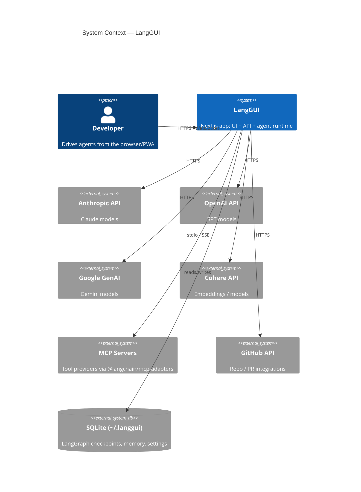

# LangGUI

A local-first, browser-based GUI for orchestrating multi-provider LLM agents — built on Next.js + LangGraph with SQLite persistence, MCP tool support, scheduled tasks, and PWA install.

## Why

A single, install-anywhere desktop-grade UI to drive Claude / OpenAI / Gemini / Cohere agents with persistent memory, scheduled background tasks, and pluggable tools (MCP) — without depending on a hosted backend.

## Architecture (C4 Context)



See [`ARCHITECTURE.md`](./ARCHITECTURE.md) for container & component views and key flows.

## Run

```bash
# install
npm install

# configure (optional — keys can also be set in the Models panel UI)
cp .env.example .env.local

# dev
npm run dev          # http://localhost:3000

# prod
npm run build && npm start
```

## Test

```bash
npm run test:live        # live integration smoke tests
npm run test:live:full   # extended live test suite
npm run lint
```

## Deploy

Currently runs locally. PWA-installable via `next-pwa`. No CI/CD wired yet — deployment story is an open ADR.

## Owner

- **Maintainer:** Andrew Wu (`redacted@example.com`)
- **On-call / Slack:** N/A (personal project)

## Decisions

Architecture decisions live in [`docs/adr/`](./docs/adr/). See [ADR-0001](./docs/adr/0001-record-architecture-decisions.md).
