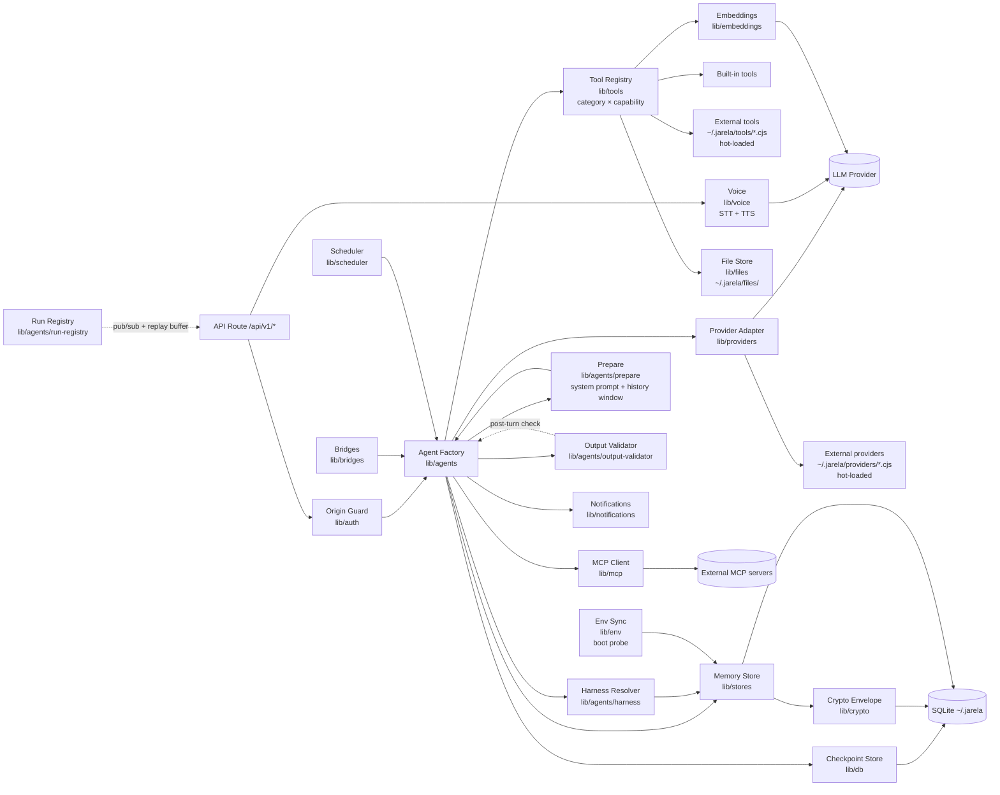
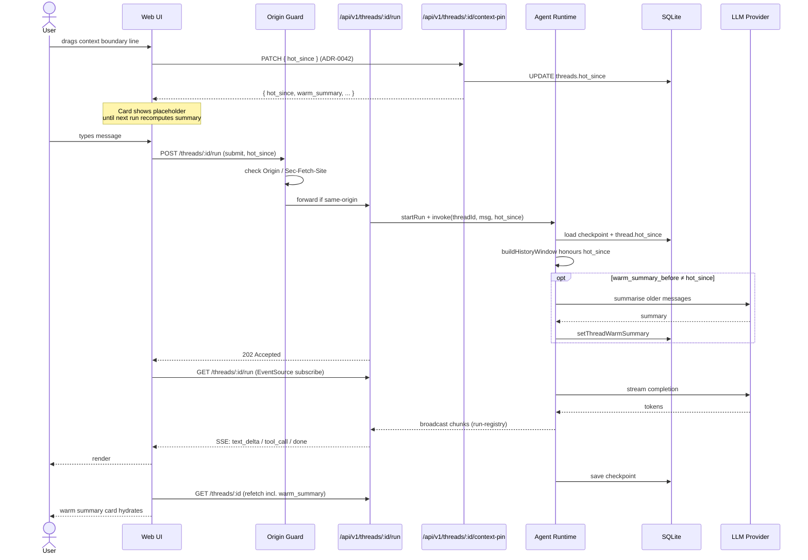
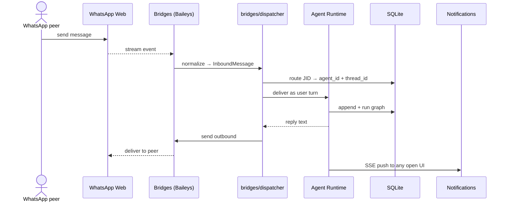
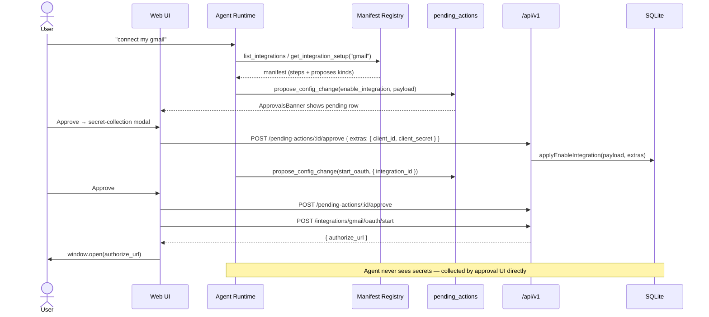
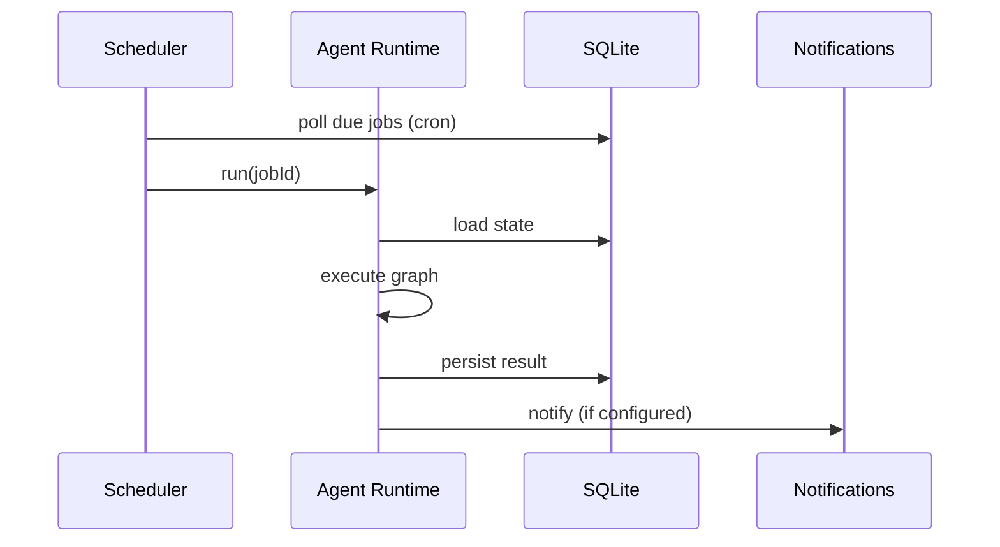

# Architecture — Jarela

## C4 — Container

```mermaid
C4Container
    title Containers — Jarela
    Person(user, "Developer", "Browser / installed PWA")
    Person_Ext(wa_user, "WhatsApp peer", "Phone number paired via Baileys")

    System_Boundary(b, "Jarela (Next.js process)") {
    Container(ui, "Web UI", "React 19 + Tailwind", "Chat, agents, models, memory, connections, and tools panels")
      Container(guard, "Origin / CSRF Guard", "lib/auth", "Rejects cross-origin mutating requests; same-origin enforcement")
      Container(routes, "API Routes", "Next.js Route Handlers", "REST + SSE endpoints under /api/v1")
      Container(agents, "Agent Runtime", "LangGraph + @langchain/*", "State-machine orchestration of LLM + tools; streams completions through providers")
      Container(providers, "Provider Adapters", "lib/providers", "Per-vendor SDK glue (Anthropic, OpenAI, Google, Cohere, DeepSeek)")
      Container(embed, "Embeddings", "lib/embeddings", "Vector embedding generator for semantic memory recall")
      Container(docs, "Document RAG", "lib/documents (+ lib/documents/remote)", "Folder indexer + remote indexers for Jira/Confluence; chunked + embedded into the documents tables; surfaced via documents_search (ADR-0024, ADR-0026)")
      Container(voice, "Voice", "lib/voice", "Gemini STT (push-to-talk) + TTS for the generate_voice tool (ADR-0017)")
      Container(mcp, "MCP Adapter", "@langchain/mcp-adapters", "Discovers & invokes external MCP tool servers")
      Container(sched, "Scheduler", "cron-parser", "Runs scheduled tasks + polls event-driven watchers; persists in DB (ADR-0022, ADR-0025, ADR-0027)")
      Container(bridges, "Bridges", "lib/bridges", "Inbound transports (WhatsApp/Baileys) routed to agents")
      Container(registry, "Run Registry", "lib/agents/run-registry", "In-memory pub/sub of in-flight agent chunks; replay buffer for reattaching EventSource clients")
      Container(crypto, "Crypto Envelope", "lib/crypto", "AES-GCM-at-rest for sensitive memory + OAuth tokens; OS keychain or .secret-key fallback")
      Container(proxy, "Proxy Dispatcher", "lib/proxy", "undici GlobalDispatcher; reads HTTP_PROXY env vars + encrypted proxy_config row; gates all outbound HTTP (ADR-0009)")
      Container(envsync, "Env Sync", "lib/env", "Probes user shell rc / Windows User-scope env for credential vars on boot (ADR-0016)")
      ContainerDb(db, "SQLite", "@langchain/langgraph-checkpoint-sqlite + native sqlite", "Checkpoints, memory, settings, schedules, proposals, bridges — at ~/.jarela")
      ContainerDb(filestore, "File Store", "lib/files + ~/.jarela/files/", "Binary artifacts produced by tools (generated images, voice clips); served by /api/v1/files/[name]")
      ContainerDb(extdir, "Extension dirs", "filesystem (~/.jarela/{providers,tools}/)", "Drop-in .cjs files for external providers + tools, hot-loaded per request (ADR-0013)")
    }

    System_Ext(anthropic, "Anthropic", "Claude")
    System_Ext(openai, "OpenAI", "GPT")
    System_Ext(google, "Google GenAI", "Gemini (LLM + STT/TTS)")
    System_Ext(deepseek, "DeepSeek", "OpenAI-compatible")
    System_Ext(cohere, "Cohere", "Embeddings")
    System_Ext(mcps, "MCP Servers", "External tool providers (stdio / SSE)")
    System_Ext(mcpreg, "MCP Registry", "registry.modelcontextprotocol.io — discovery only (ADR-0014)")
    System_Ext(github, "GitHub API", "Issues / PRs / Repos (native github_* tools, ADR-0015) + Copilot OAuth (model provider)")
    System_Ext(atlassian, "Atlassian Cloud", "Jira REST + Confluence REST (tools + document-RAG ingest, ADR-0026)")
    System_Ext(whatsapp, "WhatsApp Web", "Baileys-paired endpoint")
    System_Ext(usershell, "User shell rc / Windows User env", "Source for credential env vars (ADR-0016)")
    System_Ext(browserext, "Jarela Browser Extension", "Chrome MV3 — element picker, posts captures to localhost (ADR-0018)")

    Rel(user, ui, "HTTPS")
    Rel(ui, guard, "fetch + EventSource")
    Rel(guard, routes, "allow same-origin")
    Rel(routes, agents, "invoke")
    Rel(routes, voice, "STT/TTS + generate_voice")
    Rel(agents, mcp, "tool calls")
    Rel(agents, providers, "stream completion")
    Rel(agents, registry, "broadcast chunks")
    Rel(routes, registry, "subscribe (GET SSE) / submit (POST 202)")
    Rel(routes, sched, "register / trigger")
    Rel(sched, agents, "run scheduled job")
    Rel(wa_user, whatsapp, "message")
    Rel(whatsapp, bridges, "stream events")
    Rel(bridges, agents, "deliver as user turn")
    Rel(agents, db, "checkpoint / memory (via crypto)")
    Rel(agents, crypto, "encrypt sensitive at rest")
    Rel(agents, embed, "embed memory writes")
    Rel(agents, filestore, "write binary artifacts (image / voice tools)")
    Rel(routes, filestore, "GET /api/v1/files/[name]")
    Rel(crypto, db, "store ciphertext")
    Rel(providers, anthropic, "HTTPS")
    Rel(providers, openai, "HTTPS")
    Rel(providers, google, "HTTPS")
    Rel(providers, deepseek, "HTTPS")
    Rel(voice, google, "HTTPS (Gemini STT/TTS)")
    Rel(embed, cohere, "HTTPS (embed)")
    Rel(mcp, mcps, "stdio / SSE")
    Rel(routes, mcpreg, "HTTPS (picker search)")
    Rel(routes, github, "HTTPS")
    Rel(routes, atlassian, "HTTPS (tools)")
    Rel(sched, docs, "sweep ~10 min")
    Rel(docs, atlassian, "HTTPS (remote indexer)")
    Rel(docs, embed, "embed new chunks")
    Rel(docs, db, "document_sources / documents / document_chunks")
    Rel(agents, docs, "documents_* tools")
    Rel(agents, extdir, "scan per request (cache-busted require)")
    Rel(envsync, usershell, "read on boot")
    Rel(envsync, db, "write encrypted via crypto")
    Rel(proxy, db, "read proxy_config (via crypto)")
    Rel(providers, proxy, "outbound via GlobalDispatcher")
    Rel(routes, proxy, "outbound via GlobalDispatcher")
    Rel(browserext, routes, "POST /api/v1/page-capture (loopback)")
```



### Shared utilities

Two cross-cutting helper layers sit underneath every container above. They
are not their own boundary on the diagram — every container reaches into
them — but they are load-bearing:

- **`lib/utils/`** — `getOrCreateGlobal` (singleton pinning across HMR),
  `parseJsonSafe`, `stripHtml`, `truncateBytes`, `createOAuthFlowStore`.
  Replaces ~13 duplication patterns surfaced by the audit.
- **`lib/api/`** — `errorResponse` / `notFoundResponse` / `createdResponse`
  / `validateBody` and the per-resource `*ToResponse` row→JSON serializers
  shared between list and `[id]` route handlers.

Both layers are pure-logic and 100% line-covered by Vitest.

## C4 — Component (Agent Runtime)



## Key Flow — User sends a chat turn



## Key Flow — Inbound bridge message (WhatsApp)



## Key Flow — Agent-led integration setup (ADR-0010)



The same `propose_config_change` → `ApprovalsBanner` → `applyAction` loop also
carries agent-driven **harness edits** ([ADR-0036](./adr/0036-agent-driven-harness-edits.md)):
the agent proposes `upsert_harness` to create or modify a custom preset, and
`update_agent` (with `harness_id`) to point an agent at it. Built-in harnesses
remain read-only and the global default pointer stays UI-only — both invariants
enforced inside `applyAction`.

### Tool registry — category × capability

Every built-in tool registers with the [tool registry](../lib/tools/registry.ts)
on two orthogonal axes ([ADR-0038](./adr/0038-tool-capability-axis.md)):

* **`ToolCategory`** — topical group (`Memory`, `Files`, `Mail`, `Atlassian`,
  …). Drives the Agent editor sidebar layout. Says nothing about safety.
* **`Capability`** — safety class (`read` | `write` | `execute`).
  * `read`: pure observation, no mutations anywhere (`memory_read`,
    `web_fetch`, `jira_search`).
  * `write`: mutates local Jarela-owned state — SQLite tables, the file
    store, files in user-controlled directories (`memory_write`,
    `file_write`, `schedule_task`, `documents_add_local_source`).
  * `execute`: invokes external systems with side effects users see
    outside Jarela, OR runs arbitrary code (`local_exec`,
    `generate_image`, `delegate_to_agent`, `jira_create_issue`,
    `gmail_create_draft`).

Files with mixed capabilities (memory, files, schedule, atlassian, github,
gmail, outlook, calendar) call `registerTools` once per capability bucket.
External (`JARELA_TOOLS_DIR`) and MCP tools default to `execute` until a
manifest field overrides it. Consumers — a planned per-capability approval
gate, UI badges, the ADR-0037 validator's citation rules — switch on the
three values exhaustively. The `capability-coverage.test.ts` runtime check
asserts every registered tool has a capability so a new tool cannot land
uncategorised.

### Output validator (anti-fabrication)

`lib/agents/output-validator` post-checks every assistant turn before the
terminal `done` chunk leaves `stallRetryStream`
([ADR-0037](./adr/0037-agent-output-validator.md)). It cross-references the
assistant text against the `tool_call` chunks issued in the same turn and
flags four fabrication shapes — claim-without-tool, citation-of-an-unregistered-tool,
citation-of-an-uncalled-tool, and summary-without-action. A flagged turn
triggers the same retry path the stall detector uses (`↻` separator + a
reason-aware synthetic-user nudge); if the retry budget is exhausted,
`persistAssistantMessage` appends a visible `*⚠️ Output validator flagged: ...*`
footer to the persisted message. The validator runs entirely on regex —
no extra LLM call per turn — and is exercised by both unit tests and a
named-scenario regression set (`npm run test:eval`) seeded with real
observed hallucinations.

## Key Flow — Scheduled background task



## Key Flow — Browser-extension page capture (ADR-0018)

```mermaid
sequenceDiagram
    participant U as User
    participant BX as Browser Extension (MV3)
    participant SW as Extension Service Worker
    participant CS as Content Script (picker)
    participant PR as proxy.ts
    participant API as /api/v1/page-capture
    participant DB as SQLite
    participant BUS as Notifications Bus
    participant UI as Web UI (open tab)

    Note over SW,API: Heartbeat — every 15s
    SW->>API: GET /api/v1/health
    API-->>SW: 200 OK ⇒ icon enabled

    U->>BX: Click toolbar icon
    BX->>SW: action.onClicked
    SW->>CS: scripting.executeScript (idempotent)
    CS-->>U: Overlay banner + element-tracking outline
    U->>CS: Click target element (or ESC to cancel)
    CS->>SW: runtime.sendMessage(jarela-capture-visible-tab)
    SW->>SW: chrome.tabs.captureVisibleTab → PNG dataURL
    SW-->>CS: dataURL
    CS->>CS: crop to element bounding rect (OffscreenCanvas, devicePixelRatio)
    CS->>SW: runtime.sendMessage(jarela-capture, {text, selector, screenshot})
    SW->>PR: POST /api/v1/page-capture (Origin: chrome-extension://…)
    PR->>PR: Loopback Host check ✓; carve-out skips Origin check
    PR->>API: forward
    API->>API: Truncate text to 100KB UTF-8; validate screenshot ≤ 4MB base64
    API->>DB: addMessage(thread, "user", [text, image] when screenshot present)
    API->>BUS: publish(thread_message_added)
    API-->>SW: 200 {thread_id, msg_id, truncated, originalBytes}
    SW-->>CS: ack
    CS-->>U: Flash + "✈ Sent" pill animation + success banner
    BUS-->>UI: SSE: thread_message_added
    UI->>UI: dispatch jarela:thread-updated → re-fetch messages (image renders inline)
```

## Non-Functional Requirements

| NFR | Target | Notes |
|---|---|---|
| Cold start (dev) | < 5 s | `npm run dev` |
| First token latency | < 1.5 s p95 | Network-bound on provider |
| Local-only operation | required | No telemetry, no required cloud backend |
| Persistence | survive process restart | All state in `~/.jarela/*.sqlite` |
| API key handling | never leave the host | Stored in DB or env, not synced |
| Same-origin enforcement | required | CSRF / DNS-rebinding guard in `lib/auth/access.ts` |
| Secrets at rest | required for sensitive namespaces | AES-GCM envelope, master key in OS keychain or `.secret-key` fallback |
| Outbound proxy support | required on corporate networks | env vars or in-app `proxy_config` row, applied via undici `setGlobalDispatcher` (ADR-0009); env wins over DB |
| Stream resilience | reattach within seconds of network change | EventSource auto-reconnect + 4000-event replay buffer in `lib/agents/run-registry.ts` (ADR-0008) |
| CI on every push | required | `.github/workflows/ci.yml`: lint + tsc + build + live integration suite |

## External Dependencies

| Dependency | Purpose | Failure mode |
|---|---|---|
| Anthropic / OpenAI / Google / Cohere | LLM inference | Surface provider error to UI; allow model switch |
| Google GenAI (Gemini) — STT + TTS endpoints | Push-to-talk voice input + `generate_voice` tool (ADR-0017) | Voice surface degrades to text-only; chat continues |
| MCP servers | External tools | Tool call returns error; agent can recover or skip |
| External provider/tool `.cjs` files (~/.jarela/{providers,tools}/) | User-authored extensions, hot-loaded | Validation errors surfaced in `GET /api/v1/extensions` and the Extensions tab; loader skips invalid files (ADR-0013) |
| User shell rc (`~/.zshrc`/`~/.bashrc`) on macOS/Linux, User-scope env on Windows | Source for credential env vars (ADR-0016); probed at boot + on demand | Probe failure surfaces a warning, app falls back to whatever is already in `process.env`; tools surface "not configured" via the existing env-then-DB resolver |
| GitHub API (`api.github.com`) | Native `github_*` tools — issues, PRs, repos (ADR-0015); Copilot OAuth for the model provider | Tool call returns the API error; agent can recover or skip |
| SQLite (local) | Persistence | Fatal — startup fails fast with clear error |

## Decisions

See [`docs/adr/`](./docs/adr/). Significant choices on persistence, agent runtime, and provider strategy will be recorded as ADRs.
