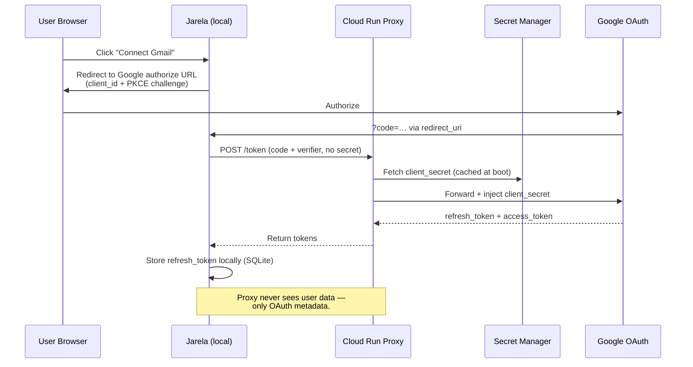

# Demo: Gmail OAuth one-click connect (proxy-backed)

Shot list for the demo video showing the Cloud Run OAuth proxy in
action. The headline: a user installs Jarela from npm, clicks
"Connect Gmail", and gets a working integration with **no
client_secret to paste**. The secret lives in Secret Manager and the
proxy injects it server-side.

Reference architecture: [proxy/README.md](../proxy/README.md).

---

## Pre-recording checklist

Run these on a fresh machine (or a fresh VM snapshot) to mirror what
a first-time viewer sees. Skip steps already done if recording on a
dev box.

```powershell
# 1. Stop any running Jarela
Get-Process node -ErrorAction SilentlyContinue |
  Where-Object { $_.Path -like "*jarela*" -or $_.CommandLine -like "*jarela*" } |
  Stop-Process -Force

# 2. Wipe the local data dir (Windows path; on macOS/Linux it's ~/.jarela)
$dataDir = Join-Path $env:LOCALAPPDATA "Jarela"
if (Test-Path $dataDir) {
  Move-Item $dataDir "$dataDir.bak-$(Get-Date -Format yyyyMMddHHmmss)"
}

# 3. Confirm proxy is healthy
./proxy/scripts/smoke-test.ps1
# Expected: HTTP 400, error=invalid_grant
```

Recording setup:
- **Resolution**: 1920x1080 (16:9) for desktop for a full-screen desktop clip,
  or 540x960 9:16 for a vertical mobile clip.
- **Terminal font**: 18pt minimum (Cascadia Code, Consolas).
- **Browser**: separate Chrome profile with no extensions, devtools
  closed, theme matching Jarela (dark).
- **Audio**: optional voiceover, or rely on captions.

---

## Shot list (~90 seconds)

### Scene 1 — Install (~10s)

**Visual**: a clean PowerShell window.

**Caption**: "One command. No secrets to paste."

```powershell
npm install -g @circuitwall/jarela
```

**Cut when**: install finishes ("added 1 package").

### Scene 2 — Launch (~10s)

**Visual**: still the same terminal.

```powershell
jarela
```

**Caption** (overlay on terminal output): "Local. Single process.
SQLite. No cloud account needed."

**Cut when**: `✓ Ready in Nms` and `Local: http://127.0.0.1:4312`
appear. Hold the Local URL line for 1s.

### Scene 3 — First load (~10s)

**Visual**: browser opens to `http://127.0.0.1:4312`. Jarela's empty
state ("Send a message to begin") renders.

**Action**: click the menu icon (top-right) → Settings → Integrations
tab.

**Cut when**: the Gmail card is visible.

### Scene 4 — One-click Connect (~20s) ⭐ HEADLINE

**Visual**: Gmail card. **Highlight that there is no "client_secret"
input field** — only a "Connect Gmail" button.

**Caption**: "No GCP project. No JSON. Just click."

**Action**: click "Connect Gmail". Browser handoff to Google opens in
a new tab.

**Visual**: Google consent screen. Select account → review scopes
(Gmail readonly + compose, Calendar) → click Allow.

**Cut when**: browser returns to `http://127.0.0.1:4312/...?code=...`
and the Gmail card flips to "Connected as <email>".

### Scene 5 — Behind the scenes (~15s)

**Visual**: split-screen or quick cut to a diagram (or just narrate
over the connected card).

**Caption sequence** (1.5s each):
- "Jarela holds only the public client_id"
- "Your refresh_token never leaves your machine"
- "client_secret lives in Google Secret Manager"
- "A Cloud Run Function injects it server-side"
- "Region: europe-west1 · Runtime: Node 22"

**Optional B-roll**: a Cloud Console tab showing the secret entry,
the function logs, or `proxy/README.md` open in an editor.

### Scene 6 — Use it (~20s)

**Visual**: back in Jarela main chat.

**Action**: type "Summarize my 5 most recent unread emails."

**Cut when**: streaming response begins, showing real email subjects.
Cut before any private content is visible (or pre-blur sensitive
areas in post).

### Scene 7 — Close (~5s)

**Visual**: Jarela's response panel.

**End card**: "Jarela · github.com/CircuitWall/jarela · `npm i -g
@circuitwall/jarela`"

---

## Recording tools

### Manual capture (recommended for all scenes)

Google's consent screen blocks Playwright/headless flows, so the OAuth
hop must be hand-recorded. All scenes are best captured manually. Tools:

- **OBS Studio** (free, cross-platform): Scene Collection with
  separate sources for terminal and browser, hotkey-switchable.
- **Xbox Game Bar** (Win+G, Windows built-in): one-click record,
  saves to `Videos\Captures`.
- **ScreenToGif** (Win): great for short embedded clips.

---

## Caption / VO script (60-second cut)

> 00:00 — "Connecting your Gmail to a local AI usually means making
> a GCP project, generating credentials, and pasting a secret you
> have to rotate yourself."
>
> 00:10 — "Jarela ships with a hosted OAuth proxy. The client_id is
> bundled. The client_secret never touches your machine — it lives
> in Google Secret Manager and gets injected server-side."
>
> 00:25 — "Install with one command. Click Connect Gmail. Done."
>
> 00:40 — *(show a real query)* "Your refresh token stays local.
> Every token-exchange call routes through the proxy, which
> forwards to Google with the secret attached."
>
> 00:55 — "Jarela — local AI, batteries included."

---

## Failure modes to avoid on camera

| Symptom | Cause | Fix before recording |
|---|---|---|
| Card shows "Configure" instead of "Connect" | A `GMAIL_CLIENT_ID` env var is set, overriding the bundled client | `Remove-Item Env:GMAIL_CLIENT_ID` before launch |
| Connect returns `invalid_client` | Proxy secret is wrong or missing | Run `proxy/scripts/rotate-secret.ps1 -JsonFile <fresh JSON>` |
| Connect returns 401 / 403 | Public invoker missing on Cloud Run service | `gcloud run services add-iam-policy-binding jarela-oauth-proxy --member=allUsers --role=roles/run.invoker --region=europe-west1` |
| Google consent rejects with `redirect_uri_mismatch` | OAuth client config drift | Reset Authorized redirect URIs in GCP console to `http://localhost:4312/api/v1/integrations/gmail/oauth/callback` (plus any other ports you use) |

---

## Proxy-architecture diagram (optional inset for Scene 5)


