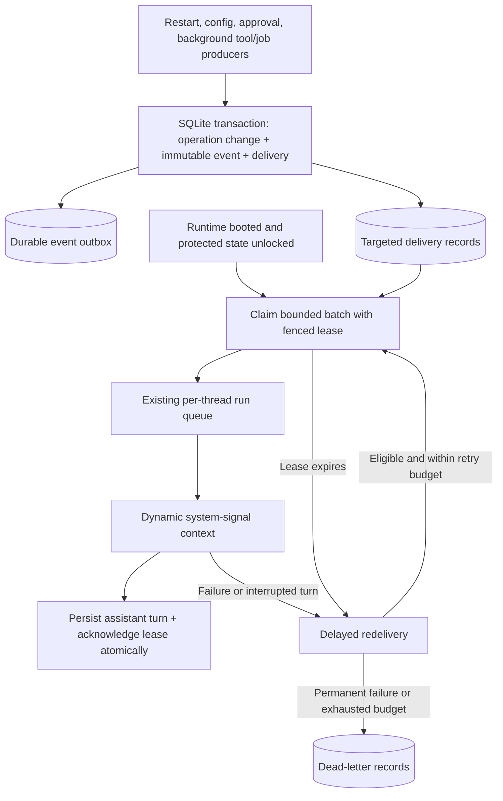

# Durable agent system signals

## Context

UI notifications and background tool results are process-local. They cannot
reliably tell an agent that a requested restart completed, or that background
work was interrupted by that restart. Lifecycle facts must not be inferred
from console logs or mistaken for authorization to repeat an operation.

## Decision

Use established transactional-outbox, competing-consumer, peek-lock,
correlation-identifier, and idempotent-consumer patterns. Implement them in
the existing SQLite database and single Next.js process, not a new broker.
The initial one-table prototype is replaced by separate operation, event,
and delivery tables.

### Separate responsibilities

1. `runtime_operations` records operation identity, origin instance, owner,
  and lifecycle: accepted, completed, failed, or outcome_unknown.
2. `signal_events` is an immutable, versioned event/outbox journal. Each
   event has a monotonic sequence, event ID, type, operation/correlation ID,
  target agent/thread, and bounded payload. The operation ID correlates the
  result with its original request; a separate causation chain is deferred.
3. `signal_deliveries` records consumer state independently: ready, leased,
  acknowledged, or dead_letter. Track attempt count, next eligible
   delivery time, lease token/deadline, and a non-sensitive failure code.

A completed operation may have an undelivered notification. Acknowledging
its notification does not change its outcome or authorize another operation.

### Architecture



### Publication and delivery guarantees

- Commit the domain state change and its outbox event/delivery in the same
  SQLite transaction wherever both live in this database. Rollback must
  publish nothing. A committed publication is not a consumer acknowledgment.
- External tool side effects cannot be made atomic with SQLite. Persist
  intent before invoking; persist the observed outcome afterward. A crash
  between the external effect and its receipt means outcome_unknown, not
  success or permission to replay the tool.
- Use producer idempotency keys and unique event/recipient constraints.
  Redelivery retains the same event ID; attempts receive new lease tokens.
- Claim only after entering the existing serialized thread run. Make claims
  atomic, scoped to the agent/thread, bounded in count and prompt size, and
  ordered by journal sequence within eligible batches, not wall-clock
  timestamps. Delayed redelivery can arrive after newer events; strict FIFO
  across retries is not promised.
- An acknowledgment must match the current unexpired lease token. Stale
  workers cannot acknowledge a message reclaimed by another turn.
- A provider `done` chunk alone is not a delivery acknowledgment. Commit the
  successful assistant transcript and delivery acknowledgment together.
  Failed, aborted, or unpersisted turns retain their signals for redelivery.
- Extend a lease only while its owning run is alive; otherwise reclaim it
  after expiry. Restart recovery also invalidates old-instance leases.
- Redeliver with bounded exponential backoff and jitter. Permanent failures
  or exhausted attempts go to a visible dead-letter record, never an
  unbounded immediate retry loop. The initial version retains diagnostics
  but does not expose an operator replay UI or automatic replay behavior.
- Delivery is at least once. Deduplication does not guarantee exactly-once
  external effects or make arbitrary model-generated writes idempotent.

### Restart and background tools

```mermaid
sequenceDiagram
  participant Agent
  participant Host as Current Jarela instance
  participant DB as SQLite journal
  participant New as New Jarela instance
  Agent->>Host: Authorized restart, operation ID
  Host->>DB: Commit accepted operation before exiting
  Host-->>Agent: Accepted, not completed
  Note over Host: Process exits; active tool outcomes may be unknown
  New->>New: Finish bootstrap and protected-state initialization
  New->>DB: Reconcile accepted operations from a different instance
  New->>DB: Commit restart-completed event and targeted delivery
  Note over New: No automatic repetition of interrupted tools
  New->>New: Schedule bounded owning-agent continuation
  New->>DB: Claim ready signals with lease
  New-->>Agent: Inject correlated lifecycle facts into dynamic context
  New->>DB: Persist successful turn and acknowledge matching lease
```

Restart completion requires a different runtime instance and successful
initialization of the protected state needed for delivery. An unlock event
alone is not proof that all startup services are ready.

Keep `async_run` as the execution mechanism. Publish background completion,
failure, timeout, or interruption events using its tracking key as the
correlation ID. Timeouts and process death do not prove an external action
failed. Do not automatically replay those calls. Result references must
state their lifetime. Process-local or expired references are unavailable
after restart. Encrypted durable result envelopes survive until their
seven-day retention deadline. Owned oversized success/error output uses
encrypted owner-scoped virtual references with UTF-8-safe, transport-bounded
paging, not plaintext spills. Legacy unowned references remain unchanged.

### Agent policy and operations

Deliver signals in the dynamic prompt suffix, outside shared and agent-stable
cache boundaries. Wake the owning agent for a completed authorized background
tool or accepted restart; do not wake for every config, approval, or job event.
Use the existing thread queue and run watchdogs, batch events, and bound failed
deliveries. A wake-up reads results and reports only, using a read-only tool
overlay also enforced by the proxy. It never grants new permission or repeats
the background tool; further writes require a new direct user turn. Restart
has a separate completion-turn guard and stable request-message correlation.

Persist bounded background result envelopes encrypted with the existing master
key. `tool_result_get` and `tool_result_list` enforce owner-thread access for
these records. Completed outcomes survive restart for seven days; interrupted
operations remain unknown and are not replayed. Owned result envelopes are
bounded to 2 MiB; overflow produces a terminal failure receipt. Owned native
Claude/Codex jobs use the same terminal lifecycle and encrypted retrieval.

Commit result and outcome events atomically. Transient settlement failures
retain the observed outcome for bounded retries on the existing result
sweeper. Transcript persistence and lease acknowledgment have one owner;
failed commits promptly release the lease. Reserve approval capacity before
application and fence duplicate application, terminal overwrites, and late
denial. Process-wide coordinator state preserves these rules across Next
route bundles and module reloads. Completion reads do not launch new tasks.

Signals are runtime observations, not user commands or approvals. Route
only to the owning agent/thread; no blanket broadcast of private outcomes.
Store bounded metadata and references in signals, not secrets, raw tool
arguments, or raw results. Background result envelopes are stored separately
using the existing at-rest encryption policy.

Keep acknowledged entries for a bounded retention period. Do not silently
drop unacknowledged entries to make space: enforce admission limits and
report backlog, age, retry count, and dead-letter state locally. Signals
can generate UI notifications and human logs; logs are never their source.

### Verification requirements

Test transaction rollback, duplicate publication, isolation of recipients,
ordered bounded batches, stale-lease acknowledgment, expiry/reclaim, crash
after publication, failure before transcript commit, dead-letter escalation,
locked boot, and interrupted external writes. No live process restart is
required for these tests.

## Consequences

- No new service, daemon, cloud dependency, or persistent directory layout.
- Operation tracking and delivery state survive process exit and locked boot.
- Only authorized restart/background completion events wake agents; other
  event types remain passive, and continuation-originated work cannot
  recursively wake the agent.
- Durable result envelopes do not imply external-process recovery,
  exactly-once effects, or recovery of output that could never be persisted.
- The schema change is additive and idempotent; existing data needs no
  operator migration.

## Design references

- [AWS transactional outbox](https://docs.aws.amazon.com/prescriptive-guidance/latest/cloud-design-patterns/transactional-outbox.html): atomic domain/outbox publication and idempotent consumers.
- [RabbitMQ acknowledgments and publisher confirms](https://www.rabbitmq.com/docs/confirms): distinguish publication from processing, use bounded delivery and redelivery.
- [Azure Service Bus settlement and locks](https://learn.microsoft.com/en-us/azure/service-bus-messaging/message-transfers-locks-settlement): explicit completion, leased ownership, abandonment, and dead letters.
- [Enterprise Integration Patterns: correlation identifier](https://www.enterpriseintegrationpatterns.com/patterns/messaging/CorrelationIdentifier.html): correlate an outcome with the request that caused it.